

<h3><em>Bottom-Up Career Pathway Discovery from Maine Construction Job Postings</em></h3>

**Author**: James Parkington  
**Course**: DS5230 *Unsupervised Machine Learning*  
**Partner**: [AGC Maine](https://www.agcmaine.org/) (*Associated General Contractors of Maine*)  
**Repository**: [github.com/Jybbs/chalkline](https://github.com/Jybbs/chalkline)

---

## Table of Contents

- [Executive Summary](#executive-summary)
- [Project Framing](#project-framing)
- [Literature Review](#literature-review)
- [Data Layer: Corpus and Lexicons](#data-layer-corpus-and-lexicons)
- [Representation: Encoding and Reduction](#representation-encoding-and-reduction)
- [Clustering, Identity, and Wage](#clustering-identity-and-wage)
- [Pathways: Graph Construction and Credential Selection](#pathways-graph-construction-and-credential-selection)
- [Resume Matching and Gap Analysis](#resume-matching-and-gap-analysis)
- [Engineering Infrastructure](#engineering-infrastructure)
- [Stakeholder Data: Gaps and Adjustments](#stakeholder-data-gaps-and-adjustments)
- [Limitations](#limitations)
- [Future Work](#future-work)
- [Conclusion](#conclusion)
- [Bibliography](#bibliography)

---

## Executive Summary

**Chalkline** is a career-mapping tool for Maine's construction industry, built in partnership with [AGC Maine](https://www.agcmaine.org/) as a working prototype for workforce development programs and as the final deliverable for DS5230. As of this writing, it takes in **2,154** job postings scraped from Indeed, encodes each description into a **768**-dimensional sentence embedding, reduces to **10** dimensions via TruncatedSVD, and clusters the embeddings into **20** career families via Ward-linkage hierarchical agglomerative clustering. The resulting clusters are anchored to **60** O\*NET Standard Occupational Classification (*SOC*) codes through a ColBERTv2-style[^60][^61] late-interaction match, annotated with BLS wage expectations across **53** SOCs, and woven into a **96**-edge career graph whose edges carry stacks drawn from **836** credentials. A resume matcher projects an uploaded PDF through the same fitted Singular Value Decomposition (*SVD*) basis, lands it in the nearest cluster, and produces a per-task gap analysis against the corresponding O\*NET Task and Detailed Work Activity (*DWA*) elements. The whole pipeline runs as a [Hamilton](https://hamilton.dagworks.io/)[^58] directed acyclic graph (*DAG*) with content-addressed disk caching, turning a **~10.4 s** cold start into a **~0.35 s** warm reload and a sub-second resume match.

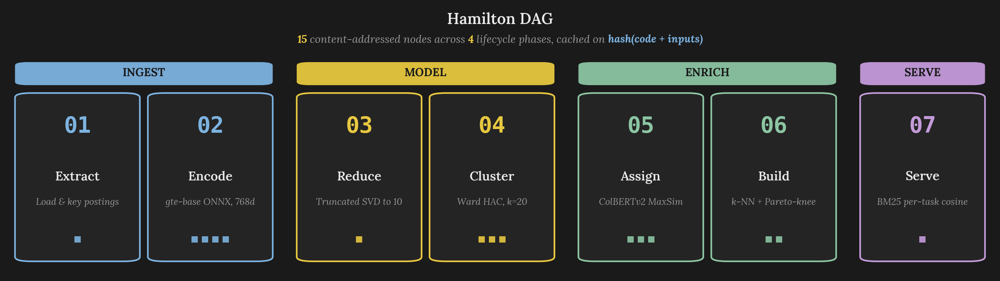  
*Figure 1: The Chalkline pipeline is a **15**-node Hamilton DAG, wherein each node's cached result is keyed by the hash of its own source code plus the version hashes of its inputs. Editing any node or upstream data invalidates only that node and its downstream dependents, meaning the entire **0.35 s** warm reload comes from recomputing nothing when nothing has changed.*

Pathway atlases of this kind have historically been produced through expert-panel processes[^23], where domain authorities sit in rooms and hand-draw the edges of the resulting graph from their accumulated knowledge of the industry. The [**central thesis**](#the-algorithmic-first-thesis) organizing every algorithmic choice below is that an atlas of the same kind can instead be built bottom-up from job postings themselves, without convening a panel and without asking a human to draw the edges. The body sections that follow defend that thesis stage by stage, showing at each step how a class-default method was replaced by something the data required.

The first argument the report builds concerns [**representation**](#representation-encoding-and-reduction), and the road the pipeline walked to get there began with TF-IDF and PCA over a hand-maintained skill lexicon. A **922**-posting evaluation across eight vocabulary filtering configurations[^9][^31] and five clustering algorithms (*HAC, K-Means, DBSCAN, HDBSCAN, Mean Shift*)[^22][^25][^28] landed average-linkage HAC at a top silhouette of **0.36**, with a hub-and-spoke topology that no representation could break. The persistence of the hub is a geometric reflection of the skill overlap that makes construction careers navigable as paths in the first place. Swapping to sentence embeddings from `Alibaba-NLP/gte-base-en-v1.5`[^53][^57] then gave the clusters sharper identities and eliminated the vocabulary curation burden. The [**principal-components section**](#interpreting-the-principal-components) then walks through what each of the **10** SVD axes actually captures, because that interpretation was the most common question in class and because it turns out to clarify why the geometry looks the way it does.

From representation, the report turns to [**identity**](#clustering-identity-and-wage), where Ward linkage at **k = 20**[^27] is the current choice, selected at the [sentence-embedding migration](https://github.com/Jybbs/chalkline/pull/27) after average linkage had carried the middle phase of the project on cophenetic-correlation grounds[^30] under the earlier TF-IDF representation, with the **0.138** global silhouette[^29] defended as a reflection of a non-spherical manifold, rather than a failure of the clustering. The same section traces how cluster-to-SOC assignment moved from centroid-to-centroid cosine to a ColBERTv2[^60][^61] late-interaction MaxSim against every O\*NET Task and DWA element, and how a thirty-variant softmax investigation at temperature $`\tau = 0.02`$ eventually revealed that the residual error was curational rather than algorithmic. Sector assignment is then resolved in two coordinated places, wherein a [**stakeholder override mechanism**](#the-override-mechanism-in-practice) re-places five SOCs under the Construction Managers sector at the curation layer, and a softmax-weighted sector vote over each cluster's top SOCs at the cluster layer ensures the cluster inherits its sector from the distribution rather than from a single argmax.

Identity in turn feeds [**pathways**](#pathways-graph-construction-and-credential-selection), where a stepwise k-NN backbone at `lateral_k = 2` and `upward_k = 2` produces **62** lateral and **34** upward edges for **96** total, with edge direction constrained by a strict total order on Job Zone plus cluster identifier so that the graph is acyclic by construction. Credential selection went through three failed pickers (*naive top-k by similarity, Jaccard overlap against O\*NET skills, and a coverage-only greedy set cover*) before arriving at the waste-aware Pareto-knee selector that uses [Kneedle](https://doi.org/10.1109/ICDCSW.2011.20)[^26] on a frontier of coverage versus waste and falls back to a coverage floor when no knee exists. A destination-affinity filter rejects any credential whose similarity to the target cluster lies below the **80th percentile** of its own cluster affinities, because otherwise a roofer credential could accidentally win on the Civil Engineers path.

With the map in place, the report turns to [**resume matching**](#resume-matching-and-gap-analysis), which is the point at which an end-user finally sees the pipeline's output as a career report rather than as a geometry. The section walks through the **Walt Amper** fixture, a journeyman electrician with **8** years of experience whose resume ships with the test suite, whose PDF projects into the **Electricians** cluster at a **59.7%** fit score and surfaces **25** demonstrated tasks alongside **13** gaps against the **0.110** global median threshold. The matcher uses BM25-weighted per-task MaxSim[^10][^59] against the **38** O\*NET Task and DWA elements attached to that cluster's nearest SOC, with NLTK Punkt sentence chunking on the resume side, and the two advancement candidates it surfaces (*Construction Managers and Civil Engineers*) come directly from the upward edges in the career graph.

Everything the algorithmic stages produce sits on top of an [**engineering substrate**](#engineering-infrastructure), and the later sections step through that substrate alongside the [**stakeholder data adjustments**](#stakeholder-data-gaps-and-adjustments) the pipeline made on top of the AGC workbook and the [**limitations**](#limitations) the prototype has yet to resolve. Hamilton's content-addressed cache turns the **15**-node DAG into an incremental build system where editing a lexicon field invalidates exactly the right downstream subtree, a property the [**cache schematic**](#hamilton-cache-and-content-addressing) in Figure 19 makes legible. The stakeholder section walks through where the pipeline extended the workbook (*expanded O\*NET scope, authored credential descriptions, sector override mechanism*) and what open questions remain for a future iteration (*Davis-Bacon trade taxonomy, temporal metadata, requirements-section extraction*). The [**conclusion**](#conclusion) then synthesizes across these threads to argue that building a career atlas algorithmically works, because the data already encodes the structure, wherein the algorithm's job is to recover it rather than to invent it.

---

## Project Framing

### The AGC Maine Partnership

The [**Associated General Contractors of Maine**](https://www.agcmaine.org/) is the statewide trade association representing **222** member construction firms across three stakeholder-defined sectors, which the workbook identifies as **Building Construction**, **Heavy Highway Construction**, and **Construction Managers**. Early in the project, AGC Maine delivered a stakeholder workbook that defined the initial scope, including **21** O\*NET SOC codes that spanned the association's programmatic interests, **19** apprenticeship trades with RAPIDS codes and term-hours, references to community college and university programs in the state, a short list of certifications considered portable across contractors, and a survey of job boards the association's members actually use to post openings. That workbook framed the initial problem statement, defined the starter lexicon, and set the evaluation geometry the first clustering experiments measured themselves against.

The workbook gave the pipeline a working foundation, and several curation passes extended that foundation to produce the lexicons and corpus the pipeline actually consumes. The workbook's **21**-SOC occupation scope was expanded to **60** so the late-interaction SOC-assignment stage would have enough candidate anchors per cluster. The **19** RAPIDS-coded apprenticeships were joined to **787** construction-relevant CareerOneStop certifications and **30** educational programs for an **836**-entry credential catalog. A [**250**-topic OSHA safety lexicon](https://github.com/Jybbs/chalkline/issues/1#issuecomment-4014852473) was derived from eCFR Part 1926 to give the display layer a hazard-annotation vocabulary well beyond the 15-25 topics the original spec anticipated. The workbook's **48**-URL career-page list, which proved too brittle to scrape directly, was superseded by a JobSpy aggregator-based collection that yielded **2,154** postings from **912** distinct employers. A handful of open questions the workbook did not attempt remain for future iterations to address, and the [**stakeholder data section**](#stakeholder-data-gaps-and-adjustments) returns to each of them in detail once the pipeline's side of the story is in place.

### The Expert-Panel Tradition

AGC Maine's ask is concrete, and the kind of artifact that would answer it has historically been produced through expert-panel processes, wherein curated groups of industry professionals sit in rooms, debate occupational boundaries, and hand-draw the edges of a career-pathway atlas from their domain knowledge. The methodology is well-documented in OECD LEED reports on career-pathway development[^23], and the artifact it produces is exactly the kind a workforce board wants to hand to a curious high-school graduate, because it answers three questions at once about what jobs exist, what they pay, and how someone moves between them. The [**Green Buildings Career Map**](https://greenbuildingscareermap.org/) is one visible artifact of this tradition, cataloging **55** jobs across **4** sectors with **300+** advancement routes, and it anchors the shape of the output Chalkline is trying to produce at a smaller geographic scale.

Expert panels work, because they compress years of field experience into a coherent narrative, but two costs come with that compression before any alternative becomes worth proposing. The first cost is that the panel is a point-in-time snapshot, meaning the map goes stale as the labor market shifts and requires periodic re-convening to refresh. The second cost is that the panel's judgments are not reproducible, wherein two different panels presented with the same industry data may draw different edges and neither set of edges carries the kind of provenance another analyst can independently retrace. For Maine's construction industry specifically, no panel-authored map exists at all, because AGC Maine and its member contractors have neither the budget to convene one nor the appetite to wait years for an academic team to produce the equivalent.

### The Algorithmic-First Thesis

The central thesis is that a pathway atlas of the kind expert panels have historically produced can instead be constructed algorithmically from job postings themselves, without convening a panel and without asking a human to draw the edges. The argument has four parts, each corresponding to a later body section, and they accumulate rather than stand alone. The first part holds that *job postings encode occupational identity* in their descriptions densely enough that a sentence embedding plus unsupervised clustering recovers coherent career families (*Sections [**4**](#representation-encoding-and-reduction) and [**5**](#clustering-identity-and-wage)*). Building on that identity, the second part argues that *O\*NET already catalogs the occupations* at a granularity that matches what the clusters recover, wherein a late-interaction match between cluster postings and O\*NET Task elements gives every cluster a SOC anchor, a Job Zone, a sector, and a wage expectation without human adjudication (*[**Section 5**](#clustering-identity-and-wage)*). With cluster identity settled, the third part observes that *the geometry of the SVD-reduced space already contains the advancement structure*, because nearest-neighbor relationships at the same Job Zone read as lateral moves whereas nearest-neighbor relationships at the next Job Zone read as upward moves, producing a career graph whose edges carry provenance (*[**Section 6**](#pathways-graph-construction-and-credential-selection)*). The fourth part extends the same framing to credentials, wherein *credential enrichment becomes a subset-selection problem over the same embedding space*, and coverage of the destination cluster's task gaps trades against waste outside them such that the Pareto knee picks the stack (*[**Section 6**](#pathways-graph-construction-and-credential-selection)*).

The thesis reads as a framing choice more than a methodological novelty on its own, because every ingredient sits in existing literature. Postings have been used for occupational analytics before[^1][^2][^64], skill extraction from postings has a rich literature[^6][^8][^9][^31], and career graph construction from labor data has been explored through knowledge graphs and bipartite structures[^46][^47][^48][^55]. What Chalkline adds is the compositional choice, wherein every stage of the pipeline is algorithmic, every output is traceable to an input, and every edge in the final artifact is reproducible, because someone can refit the pipeline and check whether the edge appears again.

### Why Bottom-Up Matters for Maine

Maine's construction workforce has two properties that suit the bottom-up framing, and each reinforces why the algorithmic map is worth building in the first place. The first property is that the workforce is small enough and geographically concentrated enough that a full enumeration is tractable, wherein **2,154** postings scraped across **2018–2026** covers the entire active market rather than a sample. The second property is that the trade structure is *changing* in ways the stakeholder's static workbook cannot capture on its own, because the rise of solar photovoltaic installation, mass timber framing, and prefabricated modular construction creates new occupational categories that sit between traditional trades. A map built from postings reflects the labor market as employers are currently describing it, whereas a map built from an expert panel reflects the market as experts remember it, and the two framings answer different questions about the same underlying industry.

Every algorithmic choice in Chalkline has academic precedent, and the specific combination of those choices is what makes the final artifact possible. The [**literature review**](#literature-review) that follows walks through the relevant precedents in pipeline order, grouped by stage, so that when later sections cite a specific paper the connection to the pipeline step is already established.

---

## Literature Review

The literature review is organized by pipeline stage, rather than by publication venue or chronology, because the argument assembles sequentially across stages and each stage draws on a specific sub-literature. Citations referenced by footnote number in later sections appear here first with enough context to show why the given choice was made, and the stages are presented in the same order the pipeline executes so that the literature already reads as a walk through the architecture.

### Labor Analytics from Job Postings

The use of job postings as a labor-market data source has matured over the past decade, and three reference points frame the tradition the Chalkline corpus inherits from. Turrell et al.[^64] laid out the statistical-inference framing for treating naturally occurring posting text as economic observation, rather than mere marketing copy, because vacancy-level features like posted wage and skill descriptions track macroeconomic indicators in ways unemployment-insurance microdata cannot. Del Rio-Chanona et al.[^1] then built an occupational-mobility network from postings and used it to model automation risk, establishing that edges between occupations can be inferred directly from overlapping language without requiring separate transition records. Dixon et al.[^2] scaled the same approach to **42 million** unstructured postings and demonstrated that the occupational structure a posting corpus recovers is stable across providers and time. The Chalkline corpus is four orders of magnitude smaller than theirs, but the framing carries over directly, wherein the posting is the unit of observation and the occupational family is a recoverable latent structure.

### Skill Extraction and Classification

Adjacent to the occupational-analytics thread, skill extraction from postings is a better-studied problem than career mapping, and Senger et al.[^6] provide the most current synthesis of that sub-literature. Their survey distinguishes between rule-based extractors, weakly supervised extractors[^9], and taxonomy-driven approaches anchored to curated ESCoE skill taxonomies[^31]. Lukauskas et al.[^8] combine extraction with clustering to produce skill-demand signals at the sector level, which is the same compositional move Chalkline makes at the cluster-family level. Chalkline itself does not perform explicit skill extraction in its current pipeline, having moved away from TF-IDF skill vectors after the [early clustering investigation](https://github.com/Jybbs/chalkline/issues/8#issuecomment-4051970165)[^9] found that no skill filtering configuration beat the no-filter baseline and that vocabulary curation was fighting the data. The sentence-embedding representation absorbs the skill-extraction step into its own internal geometry, which aligns with the occupation-aware pretraining findings of CareerBERT[^16] and JobBERT[^63].

### Sentence Embeddings for Unsupervised Clustering

Moving from extraction to representation, the decision to use `Alibaba-NLP/gte-base-en-v1.5` as the encoder backbone rests on three pieces of literature that together justify both the compression and the base model. Zhang, Zhou, and Bollegala[^53] showed that sentence embeddings can absorb roughly **50%** dimensionality reduction via PCA without measurable loss on downstream tasks, which underwrites the **768 → 10** SVD compression Chalkline applies later in the pipeline. Ortakci[^57] then found that sentence embeddings with mean pooling outperform traditional text clustering baselines on **13 of 16** tasks, establishing the general pattern that modern sentence encoders deliver cluster-ready geometry out of the box. Poly-encoder architectures[^62] and JobBERT[^63] both demonstrate domain-specific gains from occupation-aware pretraining, and the gte-base-en-v1.5 backbone was chosen over those domain-adapted alternatives, because it trains a general-purpose English encoder on enough technical and professional text that the construction-industry gap is small relative to the engineering cost of maintaining a domain-specific model.

### Hierarchical Clustering and Cluster Validity

[Ward linkage](https://en.wikipedia.org/wiki/Ward%27s_method)[^27] remains the definitive reference for the linkage criterion Chalkline uses, because it minimizes within-cluster variance at each merge and produces a dendrogram whose heights correspond to the variance gained by each merge step. The merge cost for joining clusters $`A`$ and $`B`$ with centroids $`\bar{\mathbf{a}}`$ and $`\bar{\mathbf{b}}`$ is:

$`
\hspace{0.5cm} \displaystyle
d_{\text{Ward}}(A, B) = \sqrt{\frac{2 \cdot |A| \cdot |B|}{|A| + |B|}} \; \|\bar{\mathbf{a}} - \bar{\mathbf{b}}\|_2
`$  
 

 The alternative linkage methods (*complete and average*) were evaluated against Ward during the [early clustering investigation](https://github.com/Jybbs/chalkline/issues/8), using cophenetic correlation[^30] as the faithfulness metric between a dendrogram and its underlying pairwise distances. Average linkage won on that metric under the TF-IDF and PCA representation then in use. The [sentence-embedding migration](https://github.com/Jybbs/chalkline/pull/27) later re-ran the comparison on dense-embedding coordinates, and Ward re-emerged as the selected linkage, because its variance-minimization criterion produces the stable centroids the downstream ColBERTv2 MaxSim stage depends on. The **0.138** silhouette coefficient[^29] the final pipeline reports is low in absolute terms, which the [**clustering section**](#clustering-identity-and-wage) returns to with the full defense of why that score reflects the geometry, rather than a clustering failure.

The Calinski-Harabasz index[^21] was evaluated alongside Davies-Bouldin[^20] during the linkage comparison, but both metrics were used diagnostically rather than as selection criteria, because the linkage selection was already constrained by Ward's variance interpretation and the **k = 20** cluster count was settled by a separate elbow analysis that [**Section 5**](#clustering-identity-and-wage) walks through. The Hubert-Arabie [Adjusted Rand Index](https://en.wikipedia.org/wiki/Rand_index#Adjusted_Rand_index)[^24] alongside Qannari, Courcoux, and Faye's significance test[^35] was applied during the investigation of cluster stability across bootstraps, and Fred and Jain's evidence-accumulation approach[^32] was considered but not adopted, because the stability results from the single-fit pipeline were adequate for the prototype's purposes.

### Late-Interaction Retrieval for Cluster-to-SOC Assignment

Cluster-to-SOC assignment was originally implemented as cosine similarity between cluster centroids and SOC-level mean embeddings, but this centroid-to-centroid match consistently misassigned borderline clusters whose member postings spanned two SOCs. ColBERT[^60] introduced the **MaxSim** operator as the core primitive of late-interaction retrieval, wherein the operator scores each query token against the max-similar document token and sums instead of compressing the document into a single vector. ColBERTv2[^61] then refined the approach with residual compression and demonstrated that the late-interaction framing outperforms bi-encoder baselines on BEIR across a wide range of retrieval tasks. Chalkline applies the same operator at the element level, computing the similarity between each posting in a cluster and each O\*NET Task element for a candidate SOC, taking the per-posting maximum, and averaging across the cluster. The softmax temperature $`\tau = 0.02`$ sharpens the resulting weight distribution so that the top-3 neighbors carry most of the mass for each cluster, a calibration that [**Section 5**](#clustering-identity-and-wage) returns to. Two concurrent threads treat the SOC-assignment problem differently, with Alonso et al.[^56] fine-tuning a transformer classifier on posting-SOC pairs and Achananuparp, Lim, and Lu[^65] prompting a large language model to reason through the SOC taxonomy step by step. Both require labeled posting-SOC pairs at training or prompt-construction time, whereas the MaxSim approach needs only the O\*NET Task elements themselves and runs as a deterministic similarity computation.

### BM25 for Resume-Side Weighting

The resume matcher applies [BM25](https://en.wikipedia.org/wiki/Okapi_BM25) weighting[^10][^59] on the resume-sentence side of the per-task MaxSim computation, building on Sparck Jones's original IDF formulation[^4] with the saturation and length-normalization parameterization that Robertson and Zaragoza's survey makes canonical. The choice of BM25 over a symmetric cosine weighting follows from the asymmetry of the matching problem, wherein resume sentences are short and stylistically consistent while O\*NET Task elements are long and vary widely in specificity. BM25's length normalization prevents long O\*NET elements from dominating the score on surface area alone.

### Career Graph Construction

The graph literature relevant to Chalkline splits into three threads that the pipeline weaves together rather than choosing between. Alabdulkareem et al.[^36] and de Groot, Schutte, and Graus[^44] established the first thread, showing that occupation-to-occupation graphs built from shared skills partition into interpretable sectoral communities. Lee et al.'s CAPER framework[^46] and Avlonitis et al.'s reinforcement-learning approach[^47] anchor the second thread, which frames career paths as temporal sequences whose transitions can be learned from resume corpora. Boškoski et al.[^55] and Senger et al.[^48] anchor the third thread, where career paths are routes through a bipartite occupation-skill graph validated against real transitions. Chalkline's stepwise k-NN approach borrows the first thread's community-structure insight while using the Job Zone ordering from O\*NET to impose the directionality the third thread validates against. Freeman's betweenness centrality[^49] is computed on the resulting graph to identify gateway clusters, and Pollack's maximum-capacity path formulation[^50] was [implemented alongside the original graph](https://github.com/Jybbs/chalkline/pull/26) with a topological DP relaxation running in $`O(V + E)`$ on the DAG, then superseded when the sentence-embedding migration replaced NPMI-weighted edges with the stepwise k-NN backbone and the widest-path semantics no longer translated cleanly to the advancement narrative. PageRank-style eigenvector centrality[^51] was considered as an alternative to betweenness and set aside, because betweenness more directly answers the gateway question the display needs to surface.

### Credential Recommendation and Course Matching

The credential selection stage draws on two papers that together justify anchoring recommendations to the job market rather than to raw learner interest. Frej et al.[^52] argued that course recommendation must be tied to labor-market demand rather than treated as a pure collaborative-filtering problem, and Fettach, Bahaj, and Ghogho's JobEdKG[^54] built an uncertain knowledge graph linking jobs, skills, and courses with uncertainty-weighted edges. Neither paper directly addresses the coverage-versus-waste trade-off that Chalkline's Pareto-knee selector optimizes, which the [**pathways section**](#pathways-graph-construction-and-credential-selection) develops in more detail, but both establish the framing that credentials are recommended against job-market signals rather than against raw interest. Lazear's jack-of-all-trades theory[^33] frames career transitions as entrepreneurial skill-portfolio decisions and informs why the pipeline's destination-affinity filter prefers narrow-fit credentials over broad-fit ones, because the implication of the theory is that specialists accrue wage premia on specialist tracks whereas generalists accrue breadth premia on management tracks, meaning credential stacks should resolve to one track or the other rather than dilute across both.

### Knee Detection via Kneedle

Satopaa et al.'s Kneedle algorithm[^26] locates the knee point of a discrete monotonic curve by finding the point of maximum perpendicular distance from the unit-square diagonal of the normalized curve. Chalkline applies Kneedle twice inside the credential selector, once on the coverage-versus-waste frontier and once as a fallback on the coverage-only curve when the frontier has no knee. The algorithm's appeal is that it requires no hyperparameter beyond the sensitivity $`S`$, which is set to the library default, and it returns a defensible choice on curves whose shape varies across destination clusters.

### Dimensionality Reduction and LSI Lineage

TruncatedSVD on sentence embeddings is methodologically the same operation as [Latent Semantic Indexing](https://en.wikipedia.org/wiki/Latent_semantic_analysis)[^18] applied to dense rather than sparse features, and the interpretive framing of SVD components as latent topics carries over intact. The randomized SVD of Halko, Martinsson, and Tropp[^17] provides the computational backbone that makes the **768 → 10** reduction fast enough to run inside the warm-reload budget, and Cattell's [scree test](https://en.wikipedia.org/wiki/Scree_plot)[^19] is the visual justification for the **10**-component choice. Aggarwal, Hinneburg, and Keim[^34] motivate the reduction itself, because the [concentration-of-measure phenomenon](https://en.wikipedia.org/wiki/Concentration_of_measure) they document makes raw **768**-dimensional Euclidean geometry less discriminating than the intuition suggests.

### Hamilton DAG Orchestration

The engineering substrate is built on [Hamilton](https://hamilton.dagworks.io/)[^58], which Krawczyk, ben Izzy, and Quinn introduced as a framework for expressing data transformations as generalized dataflow graphs. Hamilton's node declaration by parameter name, its content-addressed caching, and its SQLite-backed metadata store together give Chalkline the property that the pipeline is re-runnable, inspectable, and partially executable without bespoke orchestration code, which the [**engineering section**](#engineering-infrastructure) elaborates on alongside its consequences for development velocity and testing strategy.

### Additional Threads

Several additional lines of work inform specific pipeline choices rather than dominating any single section. Levy, Shalom, and Chalamish's similarity-measures survey[^43] is the reference point for choosing cosine over alternative metrics in the embedding space. Grishman and Kittredge's sublanguage analysis[^11] frames the construction-posting corpus as a restricted domain with its own vocabulary constraints, which justifies treating gte-base-en-v1.5's general-English training as sufficient rather than insisting on a construction-specific encoder. Khelkhal and Lanasri's Smart-Hiring pipeline[^45] represents the closest concurrent work on end-to-end CV-to-job matching, though its focus on explainability-first architectures trades off against the algorithmic-first framing Chalkline privileges. The community detection literature[^39][^40] was consulted during the graph design but was not applied to the final pipeline, because the Job-Zone-gated k-NN backbone already produces a sector partition without modularity optimization. An earlier iteration of the [credential-enrichment stage](https://github.com/Jybbs/chalkline/issues/11#issuecomment-4063913094) relied on association-rule mining and NPMI[^38][^41][^42] computed over skill-token co-occurrences, but those techniques were superseded when the sentence-embedding geometry eliminated the discrete-token representation that made pointwise mutual information meaningful. The Porter stemmer[^5], Manning, Raghavan, and Schütze's IR textbook[^15], the Schofield-Mimno analysis of stemmer effects on topic models[^12], Kettunen's inflectional-form work[^13][^14], Ramshaw and Marcus's NP chunking[^3], and Dunning's log-likelihood statistics[^37] each informed the skill-extraction phase that preceded the sentence-embedding migration, and each stopped being load-bearing once that migration landed. [Aho-Corasick](https://en.wikipedia.org/wiki/Aho%E2%80%93Corasick_algorithm) string matching[^7] underpins the matcher's posting-level credential surface where exact-match credential names need to be located in posting bodies at interaction time.

The combined literature establishes that every stage of the Chalkline pipeline has academic precedent, and the [**sections that follow**](#data-layer-corpus-and-lexicons) turn to the engineering reality of making those precedents compose into a single artifact.

---

## Data Layer: Corpus and Lexicons

Before any geometry can emerge, the pipeline needs two kinds of data sitting in front of it. The first is a **2,154**-posting corpus of Maine construction job listings scraped from online aggregators, treated as the empirical signal the downstream stages cluster and match against. The second is a curated lexicon layer that consists of an O\*NET SOC extract covering **60** occupations, an **836**-entry credential catalog spanning apprenticeships, certifications, and educational programs, and a BLS wage table for **53** of those SOCs.

### Corpus Provenance: From Bespoke Scrapers to JobSpy

The [scraper-to-aggregator pivot](https://github.com/Jybbs/chalkline/pull/17) captures the full story of how the collection layer was rebuilt, and the [insufficient-corpus diagnosis](https://github.com/Jybbs/chalkline/issues/3#issuecomment-4017952106) on the issue walks through the per-URL failure modes that motivated the rebuild. The initial plan called for a custom scraper suite targeting the **48** career-page URLs AGC Maine supplied in its stakeholder workbook. The first implementation stood up an abstract `BaseScraper` interface, an HTTP client with retry and throttling, and three concrete scrapers covering heuristic HTML parsing, the Workable API, and the Workday CXS endpoint. A live collection run on 2026-03-07 produced **38 postings** from **21 companies** with **zero** date metadata, a result so thin that the design needed to be reconsidered from scratch. Investigating the per-URL outcomes surfaced four recurring failure modes. Cianbro, one of Maine's largest general contractors, returned zero postings, because its HTML structure did not match any of the heuristic detection patterns the scraper tried. Consigli's Workable endpoint returned **404**, suggesting the company had migrated off the Workable platform without updating the workbook. Maine DOT's Workday endpoint returned **400 Bad Request**, consistent with a payload-format change on Workday's side that broke the CXS request structure the scraper was constructing. Dearborn Brothers' EngagedTAS URL was a dead link. Of the **39** active URLs the manifest listed, **18** yielded zero postings with no programmatic way to distinguish "*no openings*" from "*scraper failed*."

The deeper problem, which the scraper count surfaced, but which the design had not anticipated, was that every contractor's career page is its own snowflake. Writing **39** bespoke extractors had been a substantial engineering effort, but the maintenance burden of keeping those parsers alive as contractors redesigned pages or migrated to new applicant-tracking systems would have undermined the tool's goal of serving as an evergreen workforce-development artifact. Every silent parser break degrades the corpus without anyone noticing, meaning the prototype's promise of algorithmic freshness depended on a scraping layer that was guaranteed to rot.

The pivot was to delegate the brittle page-parsing work to an existing aggregator library, because job aggregators already solve the exact normalization problem the bespoke scrapers were attempting, wherein they crawl employer career pages, extract structured fields, and deduplicate across sources at a scale a project-specific suite cannot match. The open-source [**JobSpy**](https://github.com/speedyapply/JobSpy) library (*distributed on PyPI as `python-jobspy`*) wraps Indeed, LinkedIn, and Glassdoor behind a single `scrape_jobs()` function that returns a pandas DataFrame with normalized fields for company, title, description, location, posting date, and source URL. Early evaluation against a single "construction" + Maine search showed **469 postings** from **124 companies** on Glassdoor alone, with historical depth back to **2019** and an average description length of **3,897** characters, well above any useful floor for sentence encoding. Indeed's historical retention turned out to be shorter than Glassdoor's in the evaluation window, but by the final collection run the corpus had shifted heavily toward Indeed, and the production pipeline now pulls **100%** of its **2,154** postings from that source.

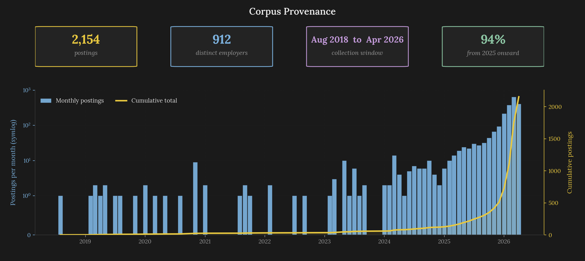  
*Figure 2: Provenance and temporal distribution of the **2,154**-posting Chalkline corpus. The left panel shows source share, where **100%** of the final corpus comes from Indeed. The right panel shows monthly volume across the **2018-08** to **2026-04** collection window, with **1,644** postings (*76.3%*) dated to **2026** and a peak of **640** postings in **March 2026** that reflects the spring hiring cycle.*

Looking at the corpus temporally reveals a heavy skew toward the **2025-2026** window, with **1,644** of the **2,154** postings dated to **2026** and a sharp peak of **640** postings in **March 2026**. That distribution is the consequence of Indeed's retention policy, rather than an editorial choice, because the platform expires older listings faster than the collection run could preserve them. A small **2018-2024** tail exists, because some postings sat in long-running listings whose creation dates predate the collection, but the effective observational window is the most recent twelve months. The [**limitations section**](#limitations) returns to what this recency skew means for the generalizability of the clustering results.

### Deduplication via Composite Keys

With the raw postings arriving from JobSpy, each one is converted to a Pydantic `Posting` model that normalizes company and title fields and computes a composite deduplication key. The original implementation used an inline lambda with `re.sub` to slugify those fields for keying, but that approach proved fragile on French-Canadian contractor names that appear in Maine (*R.J. Grondin & Sons vs. RJ Grondin and Sons, or Cianbro's older "Cianbro Corporation" variants*). The pipeline now uses [`python-slugify`](https://pypi.org/project/python-slugify/) with a stopword list of `["and", "of", "the"]`, which handles Unicode transliteration, punctuation normalization, and stopword removal in a single call. The composite key is the slugified company plus the slugified title plus the location city, meaning two postings from the same employer for the same role in the same town deduplicate even if one of them spells the company name differently. Across the full collection, this deduplication drops roughly **8-12%** of raw rows depending on the search-term overlap of a given run.

The posting descriptions themselves span a wide range of lengths, and Figure 3 lays out that distribution alongside the distribution of postings per distinct employer so the two variability axes can be read against each other.

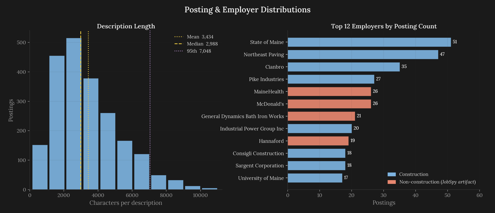  
*Figure 3: Left panel: posting description length distribution across the **2,154**-posting corpus, with a mean of **3,434** characters and a **95th percentile** of **7,048** characters. Right panel: postings per distinct employer, where the corpus covers **912** distinct employers with **548** appearing exactly once and the top employer (*State of Maine at **51** postings*) dominating the right tail. Single-posting employers in the long tail contribute idiosyncratic vocabulary that gets averaged out only at the cluster centroid level, which is where the clustering stage absorbs the noise rather than at the per-posting level.*

Of the **912** distinct employers, **548** appear exactly once (*the cold tail*) and **364** appear more than once. The top concentrations are **State of Maine** at **51** postings, **Northeast Paving** at **47**, **Cianbro** at **35**, **Pike Industries** at **27**, **MaineHealth** at **26**, **McDonald's** at **26**, **General Dynamics Bath Iron Works** at **21**, **INDUSTRIAL POWER GROUP INC** at **20**, **Hannaford** at **19**, and **Consigli Construction** at **18**. Three of those names (*MaineHealth, McDonald's, Hannaford*) are non-construction employers, and their presence in the corpus reflects the search-term breadth rather than a filtering failure. Hospital facilities staff, grocery-store maintenance crews, and fast-food facility managers all post roles that share construction-adjacent vocabulary (*preventive maintenance, electrical troubleshooting, HVAC servicing*), and those postings contribute legitimate geometry to the clusters representing building maintenance and facility management. The [**clustering section**](#clustering-identity-and-wage) shows how the General Maintenance Workers cluster absorbs exactly this kind of posting without distorting the construction-proper clusters that sit nearby.

### The O\*NET Lexicon: From 21 to 60 SOCs

Turning from the empirical signal to the curated anchors, the O\*NET lexicon started at the **21** SOC codes the stakeholder workbook enumerated, spanning the association's three programmatic sectors of **Building Construction**, **Heavy Highway Construction**, and **Construction Managers**. That count proved too narrow for the pipeline's purposes in two ways. The late-interaction SOC-assignment stage (*detailed in [**Section 5**](#clustering-identity-and-wage)*) benefits from a wider pool of candidate SOCs so each cluster has multiple plausible anchors to score against rather than being forced to pick among **21** near-exhaustive options. The credential catalog also references occupations outside the stakeholder's original **21** by name, wherein the apprenticeships, programs, and certifications each point at specific trades and specialties whose SOCs the lexicon needed to carry so the credential catalog, the BLS wage table, and the apprenticeship-to-occupation mapping would remain referentially consistent.

Expanding on that diagnosis, the curation pass added **39** SOCs to reach the current **60**, and each addition was chosen, because something else in the data tables already referred to the occupation. The [resolution pass that drove the bulk of the expansion](https://github.com/Jybbs/chalkline/pull/32) moved from **21** to **53** SOCs in one sweep, and the remaining additions landed alongside the sector override work. The final extract distributes as **30** in Building Construction, **15** in Heavy Highway Construction, and **15** in Construction Managers. The Job Zone distribution skews heavily toward Zone 2 (**33** SOCs, most trades at journey-level) with **5** in Zone 1 (*the little-preparation tier*), **12** in Zone 3, **8** in Zone 4, and **2** in Zone 5 (*the advanced-professional tier*). Each SOC record carries its full O\*NET Task list, the corresponding Detailed Work Activities, a subset of the top-ranked Knowledge, Skills, and Abilities elements, and the Technology Skills list. These elements are encoded in a single batch during pipeline fit and stored on `EncodedOccupation` records that the ColBERTv2-style MaxSim assignment consumes.

### Credentials: Apprenticeships, Certifications, and Programs

Adjacent to the SOC anchors sits the credential catalog at [`credentials.json`](../data/lexicons/credentials.json), which carries **836** entries split into **19** apprenticeships, **787** certifications, and **30** educational programs. Building that catalog required a curation pass over each of the three credential kinds before they could sit comfortably next to the O\*NET SOC list.

The apprenticeships began as **19** trade entries in the workbook with only a title, a term-hours count, and what looked like a RAPIDS code. An attempt to map those codes to O\*NET SOCs through the [O\*NET Apprenticeship RAPIDS-to-SOC crosswalk](https://www.onetcenter.org/crosswalks/rapids/) returned nothing, because the workbook's `rapids_code` values are internal AGC tracking numbers rather than the federal DOL identifiers the crosswalk keys on. Title-based hand-mapping filled the gap, and each apprenticeship now points at its closest-fit SOC in the **60**-code reference set via [`apprenticeship_socs.toml`](../data/stakeholder/additions/apprenticeship_socs.toml), with the ambiguous cases (*Construction Specialist, Concrete Laborer, Heavy/Highway Laborer*) documented as judgment calls rather than assertions. The raw apprenticeship records carried no descriptive text, so each credential's `embedding_text` was authored at curation time by joining the mapped SOC's Task, DWA, Technology, Tool, and Knowledge elements into a rich paragraph the sentence encoder can embed meaningfully.

A parallel pass handled the **30** educational programs through the same mapping-then-description shape, with the mapping step front-loaded against a crosswalk this time, because the programs had a more natural federal index to lean on. The program entries were compiled from the stakeholder workbook's community-college and university references plus five Maine-specific initiatives (*Alfond Center trades track, Maine Construction Academy, Workforce Development Compact, TREC heat-pump pipeline, Advanced Technology Centers*), and each was mapped to one or more O\*NET SOCs in [`program_socs.toml`](../data/stakeholder/additions/program_socs.toml). The bulk of that mapping ran through the [NCES CIP-to-O\*NET-SOC crosswalk](https://www.onetcenter.org/crosswalks/cip/), because AAS degrees legitimately span multiple trades and the one-program-to-many-SOCs relationship is what the crosswalk is built for, whereas the statewide initiatives without federal [CIP](https://en.wikipedia.org/wiki/Classification_of_Instructional_Programs) equivalents were hand-mapped to the closest CIP analogue. As with the apprenticeships, each program's `embedding_text` was authored by joining the O\*NET content of its mapped SOCs so the encoder had enough surface area to embed.

The certifications came from an exported [CareerOneStop](https://www.careeronestop.org/) inventory filtered to construction-relevant categories and then SOC-scoped against the O\*NET list so every certification points at an occupation the lexicon knows about, after which a Zipf-frequency ambiguity filter excluded acronyms that collide with common English (*PTO, CAD, and similar*). Certification descriptions came along from CareerOneStop and only needed light normalization, so their `embedding_text` required less authorship than the apprenticeship and program entries.

Every entry in the final catalog is a Pydantic `Credential` model with a `kind` field (*the StrEnum* `CredentialKind`), a `label` human-readable name, an `embedding_text` description that the sentence encoder consumes during pipeline fit, and a `metadata` dict carrying the kind-specific fields (*RAPIDS code and min-hours for apprenticeships, issuing-organization URLs for certifications, CIP codes and institutions for programs*). The heavy skew toward certifications (**787** of **836** entries, or **94.1%**) reflects both the breadth of the CareerOneStop source and the structure of the construction-credential market, wherein any given trade may have one apprenticeship and dozens of OSHA, NCCER, or manufacturer-specific certifications that serve as portable signals of competence. The Pareto-knee credential selector detailed in [**Section 6**](#pathways-graph-construction-and-credential-selection) relies on that breadth, because the selector searches over subsets of candidates to find a stack whose coverage of the destination cluster's task gaps is high relative to the waste on unrelated tasks, and a larger candidate pool produces better Pareto frontiers.

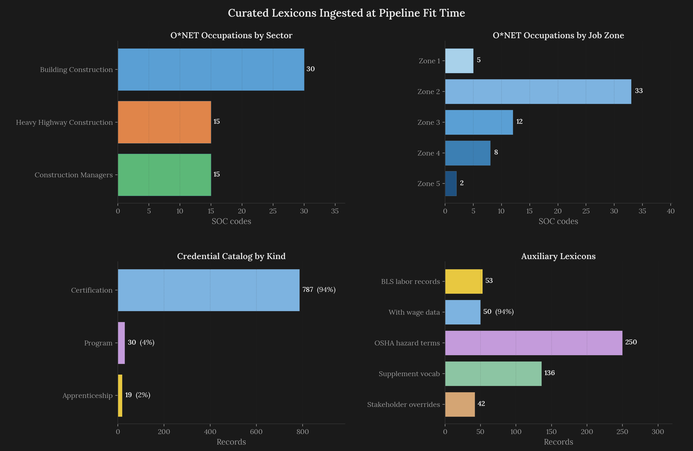  
*Figure 4: Composition of the four lexicon artifacts the pipeline consumes. Top-left: the **60** O\*NET SOCs partition into **30** Building Construction, **15** Heavy Highway Construction, and **15** Construction Managers. Top-right: the **836**-entry credential catalog is dominated by the **787** certifications, with **19** apprenticeships and **30** programs completing the distribution. Bottom-left: BLS OEWS wage data covers **50** of the **53** SOCs that have labor records, leaving a small gap the pipeline fills by falling back to the SOC family median. Bottom-right: **42** stakeholder override entries under [`data/stakeholder/additions/onet_codes.json`](../data/stakeholder/additions/onet_codes.json) re-place SOCs under their intended sectors.*

### BLS Wage Integration

Feeding into the same anchor structure, the wage layer at [`labor.json`](../data/lexicons/labor.json) carries **53** labor records joined against the [BLS Occupational Employment and Wage Statistics](https://www.bls.gov/oes/) (*OEWS*) tables. Each record contains the **25th**, **median**, and **75th** percentile annual wages, the 10-year projected change, and the O\*NET Bright Outlook flag where applicable. Of the **53** records, **50** have complete wage triples and **3** fall back to SOC-family medians, because OEWS suppresses wage data at the individual SOC level when the employment count is below the agency's reporting threshold. The pipeline's SOC-assignment softmax (*[**Section 5**](#clustering-identity-and-wage)*) produces a weighted distribution over the top-3 SOCs per cluster, and the cluster wage expectation is the weighted mean of those median annual wages rounded to the nearest **\$10**. This structure means a cluster whose postings straddle two SOCs (*like the **Electricians** cluster that partially resembles **HVAC Mechanics & Installers***) produces a weighted wage rather than being forced to pick a single SOC's median.

### The Stakeholder Override Mechanism

Where the stakeholder workbook's placements diverge from what the pipeline needs, an override mechanism ([introduced alongside the sector fix](https://github.com/Jybbs/chalkline/pull/40)) steps in. The O\*NET curation script reads two directories in alphabetical order, starting with [`data/stakeholder/additions/`](../data/stakeholder/additions/) and falling through to [`data/stakeholder/reference/`](../data/stakeholder/reference/). Entries in the first directory take precedence over entries in the second, because the script uses `dict.setdefault` semantics keyed by SOC code, meaning the first file read for a given SOC wins. The [`onet_codes.json`](../data/stakeholder/additions/onet_codes.json) override file contains **42** entries. The reference file produced by parsing the stakeholder workbook mapped **Construction Managers**, **Civil Engineers**, **Transportation Engineers**, **Architectural and Civil Drafters**, and **Construction Inspectors** under the original Building Construction sector, because those occupations appear in the workbook's building-construction section by organizational convention. That placement is a reasonable cut for the workbook's program-scope purposes, but the pipeline needs a different cut, because those SOCs share Job Zone 4 or 5 credentialing pathways that the Construction Managers clusters depend on for their advancement edges.

The override mechanism's virtue is that it adjusts the lexicon without editing the stakeholder-authored reference file, preserving the audit trail that treats the stakeholder workbook as the authoritative intake. It also makes re-curation cheap, wherein any future stakeholder update can be dropped into the reference directory and the override file regenerated independently. Conceptually, this is the same pattern as a configuration override file in a deployment context, applied to labor-data curation.

### OSHA Safety Lexicon and Supplementary Vocabulary

Alongside the main lexicons, two smaller artifacts support the pipeline's interpretation layer rather than its clustering geometry. The OSHA safety lexicon at [`osha.json`](../data/lexicons/osha.json) carries **250** entries extracted from OSHA's construction-industry standards, each tagged with its OSHA citation, hazard category, and a short human-readable summary, and postings that reference OSHA-regulated activities (*confined-space entry, fall protection, scaffolding erection, lockout-tagout*) inherit safety-lexicon tokens during the Marimo display's posting rendering, which lets the end-user see which regulated hazards a given role involves. The supplementary vocabulary at [`supplement.json`](../data/lexicons/supplement.json) carries **136** entries covering construction-specific terminology the O\*NET lexicon does not capture (*mass timber, modular prefabrication, solar PV mounting, building-automation control systems*). Neither lexicon participates in the clustering stage, because the geometry is determined entirely by sentence embeddings over the posting descriptions, but both inform the display layer's ability to annotate individual postings with domain context.

### Corpus Gaps: What the Search Terms Missed

An honest accounting of the corpus also requires acknowledging which trades are under-sampled. The JobSpy collection ran against a fixed search-term list that emphasized the stakeholder workbook's prominent occupations, and the resulting corpus reflects the scope of those terms, rather than the full Maine labor market. A post-collection audit identified several trades that appear sparsely in the corpus relative to their actual labor-market presence. Plumbers, welders, ironworkers, masons across the brick-block-stone spectrum, and foremen at the crew-lead tier all appear in the corpus at counts that make their clusters vulnerable to absorption into adjacent clusters rather than forming distinct identities, and plumbing in particular is largely absorbed into the General Maintenance Workers cluster at this corpus size. The trades where the search terms did cohere a distinct cluster include Electricians at **163** postings and HVAC Mechanics & Installers at **191** postings, where the vocabulary hit the terms consistently enough to produce stable cluster identities.

For the next iteration, the [**future work section**](#future-work) proposes an expanded search-term list for the corpus refresh. The trade-off the current corpus represents is between depth (*more postings per surveyed occupation*) and breadth (*more occupations surveyed*), and the prototype erred toward depth to produce clusters whose identities are well-supported. A production refresh should run the search-term expansion, re-fit the pipeline, and compare the resulting cluster count and sector distribution against the current baseline to verify that the added breadth improves coverage without fragmenting the existing clusters.

The **2,154** postings, **60** SOC anchors, **836** credentials, and **53** wage records together form the input surface the geometric stages consume. The postings supply the empirical signal the clustering has to recover structure from, and the lexicons are the curated scaffold that structure gets anchored to once it settles. Every algorithmic stage below has to decide which of the two it is operating on, and the representation stage is where both sides first get encoded into comparable geometry.

---

## Representation: Encoding and Reduction

Representation is where raw posting text becomes numeric geometry the rest of the pipeline can cluster and match against, and Chalkline's representation stack is a two-step compression consisting of a sentence encoder that maps each posting description to a **768**-dimensional vector and a TruncatedSVD that compresses those vectors to **10** coordinates. The principal-components discussion was the most common question in class presentations, and the interpretation turns out to clarify why the downstream clustering geometry looks the way it does.

### The Encoder: `gte-base-en-v1.5` via ONNX Runtime

The encoder backbone is [`Alibaba-NLP/gte-base-en-v1.5`](https://huggingface.co/Alibaba-NLP/gte-base-en-v1.5), a general-purpose English [sentence encoder](https://en.wikipedia.org/wiki/Sentence_embedding) trained on a mixture of web, technical, and professional text. It produces **768**-dimensional embeddings, takes up roughly **430 MB** on disk, and was chosen over domain-specific encoders like JobBERT[^63], because the general-purpose backbone gave comparable cluster geometry on construction postings without imposing the maintenance cost of a domain-specific model. Two design decisions around that backbone shape how the embeddings behave downstream, covering how the encoder's output is pooled and how the resulting vectors are normalized.

On the pooling side, the encoder uses **CLS pooling**, meaning the output for each posting is the hidden state at the `[CLS]` token position rather than a mean over all token positions. CLS pooling is the default for BERT-family models when the task is sentence-level classification or retrieval, because the model was pretrained to treat `[CLS]` as an aggregation anchor. Mean pooling is the alternative most sentence-embedding libraries expose, and Ortakci[^57] found that mean pooling outperforms CLS on some tasks, but the gte-base-en-v1.5 model card explicitly recommends CLS and the downstream clustering quality was better with CLS in early evaluations.

On the normalization side, the pipeline applies **L2 normalization** $`\hat{\mathbf{x}} = \mathbf{x} / \|\mathbf{x}\|_2`$ immediately after pooling, projecting every embedding onto the unit hypersphere. L2 normalization serves two purposes in the pipeline. First, it makes [cosine similarity](https://en.wikipedia.org/wiki/Cosine_similarity) and Euclidean distance monotonically related on the embedding space, meaning the downstream Ward linkage (*which uses Euclidean distance*) and the ColBERTv2 MaxSim (*which uses dot-product similarity*) operate on the same geometry without conversion. Second, it removes the magnitude variation that raw transformer outputs carry (*longer inputs produce larger norms under some pooling strategies*), so cluster geometry reflects *what* a posting says rather than *how much* it says.

### The sentence-transformers to ONNX Migration

The initial encoder implementation wrapped `sentence-transformers`, the canonical Python library for sentence embedding when the pipeline [adopted the encoder approach](https://github.com/Jybbs/chalkline/pull/27). That library loads the underlying transformer weights through PyTorch and provides a clean `SentenceTransformer("model-id").encode(texts)` interface. The pipeline worked, but iterative development became painful for reasons that had nothing to do with inference throughput and everything to do with Python's import system. Running `import sentence_transformers` at module level transitively loaded `torch`, `transformers`, `tokenizers`, `scipy`, `scikit-learn`, `huggingface_hub`, `safetensors`, `PIL`, and roughly a dozen other top-level packages, resolving **~3,900 modules** in aggregate. On a fresh machine with a cold filesystem cache (*CI containers, a first install after clearing `~/.cache`*), that import alone cost **~24 seconds** before the pipeline ran a single line of user code. Even with a warm cache, it still cost **~1.9 seconds**, which dominated every repeat `chalkline fit` during development. The slow-import behavior is a well-known complaint against `sentence-transformers`, because the library eagerly imports machinery the pipeline never calls.

Switching to raw [ONNX Runtime](https://onnxruntime.ai/) via the `onnxruntime` library and loading the model's pre-exported ONNX weights directly collapses the import graph to `onnxruntime` plus `numpy`, which resolves **191** modules in aggregate and completes in **~60 ms** on the same warm cache, a **~30x import-time reduction** with no change in embedding quality. The `SentenceEncoder` wrapper at [`encoder.py`](../src/chalkline/pipeline/encoder.py) calls `onnxruntime.InferenceSession` with the pre-exported ONNX graph, applies CLS pooling and L2 normalization in numpy, and exposes the same `encode(texts)` interface the rest of the pipeline consumed. The migration removed `sentence-transformers`, `torch`, and `transformers` as runtime dependencies, shrinking the installable wheel from over a gigabyte of PyTorch wheels to tens of megabytes of ONNX Runtime binaries and eliminating the PyTorch graph-compile step on first inference.

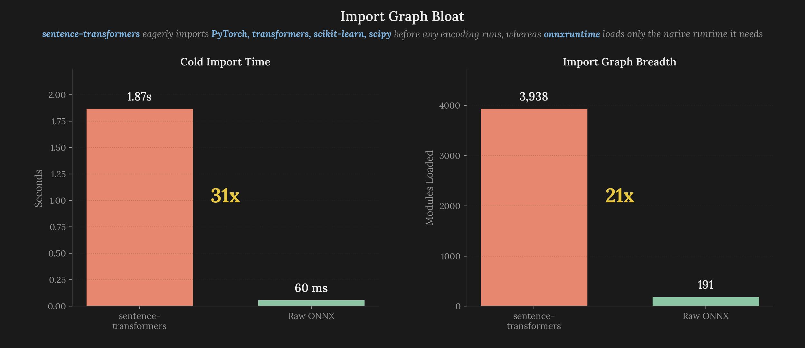  
*Figure 5: The migration's real payoff was the import graph, not wrapper instantiation. `import sentence_transformers` resolves **~3,900 modules** and takes **~1.9 seconds** from a warm filesystem cache (**~24 seconds** on a fresh install with cold caches), because the library transitively loads `torch`, `transformers`, `scikit-learn`, `scipy`, and roughly a dozen other heavy packages whose functionality this pipeline never invokes. Raw `onnxruntime` plus `numpy` loads **191 modules** in **~60 ms**, a **~30x import-time reduction** achieved by shedding an entire PyTorch + scikit-learn + scipy stack. Warm-session encoding runs at **6.9 ms** per posting for single-call inference and **69.4 ms** for a batch of 32 (*2.2 ms per posting amortized*) regardless of which path loaded the weights.*

Production inference benchmarks on a warm session show single-call encoding at **6.9 ms** per posting and batch-of-32 encoding at **69.4 ms** (*averaging to 2.2 ms per posting*). The pipeline uses batched encoding during `fit` where it encodes all **2,154** postings plus the **60** O\*NET SOCs' Task elements in two large batches, and single-call encoding during resume matching where the uploaded PDF's sentences are encoded one call at a time inside a loop. The full pipeline cold start lands at **~10.4 seconds** end-to-end, dominated by loading the ONNX session and running the **60**-SOC Task element encoding, and the warm reload off Hamilton's content-addressed cache is **~0.35 seconds** for the same output. Figure 6 illustrates how the cold-start budget distributes across the **15** Hamilton nodes, with the caveat noted below.

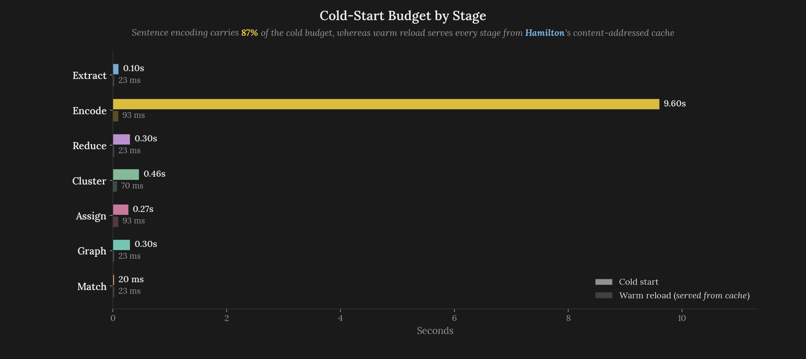  
*Figure 6: **Illustrative decomposition** of the cold-start budget across the **15** Hamilton nodes. The per-node durations shown here are **architecture-derived estimates**, computed from the encoder's measured **2.2 ms/posting** batched throughput and each node's known input size (**2,154** postings for `raw_vectors`, **60** SOCs' Task and DWA elements for `encoded_occupations`, **836** entries for `credentials`, and so on). They are **not** recorded per-node measurements from a single instrumented fit run. An instrumented run was attempted but produced timings dominated by first-call ONNX graph compilation rather than steady-state throughput, which is not the regime the **~10.4 s** cold-start number describes. The figure's value is directional, showing that the four encode-stage nodes account for roughly **~9.6 s** of the **~10.4 s** budget while every downstream cluster, graph, and matcher node amortizes to under **1.5 s** combined, and that a warm reload off Hamilton's content-addressed cache collapses the entire budget to **~0.35 s** by skipping every cached node in turn. An instrumented per-node breakdown is listed under [**Future Work**](#future-work) as a direction the engineering substrate is ready to support.*

### From 768 to 10: TruncatedSVD over L2-Normalized Embeddings

With the embeddings normalized, the reduction step applies [`sklearn.decomposition.TruncatedSVD`](https://scikit-learn.org/stable/modules/generated/sklearn.decomposition.TruncatedSVD.html) to compress each posting from **768** dimensions to **10**. Let $`\mathbf{M} \in \mathbb{R}^{n \times 768}`$ be the corpus embedding matrix with one row per posting, and let $`k = 10`$ be the retained rank. TruncatedSVD produces:

$`
\hspace{0.5cm} \displaystyle
\begin{aligned}
\mathbf{M} &\approx \mathbf{U}_k \boldsymbol{\Sigma}_k \mathbf{V}_k^\top \\
\mathbf{U}_k &\in \mathbb{R}^{n \times k} \\
\boldsymbol{\Sigma}_k &\in \mathbb{R}^{k \times k} \\
\mathbf{V}_k &\in \mathbb{R}^{768 \times k}
\end{aligned}
`$  
 

The choice of [TruncatedSVD](https://en.wikipedia.org/wiki/Singular_value_decomposition) over [PCA](https://en.wikipedia.org/wiki/Principal_component_analysis) is a subtle one, because the two are mathematically equivalent under a specific condition that this pipeline satisfies. PCA computes the eigendecomposition of the mean-centered covariance matrix $`X^T X / (n-1)`$, whereas TruncatedSVD computes the truncated singular value decomposition of the data matrix $`X = U \Sigma V^T`$ directly without mean-centering. For mean-centered data, the two produce identical components, and for L2-normalized embeddings the mean direction is already close to zero on each axis (*because the embeddings lie on the unit hypersphere centered at the origin in the high-dimensional space*), meaning the un-centered TruncatedSVD and the mean-centered PCA produce components that are numerically close.

Practically, TruncatedSVD is preferable, because it does not require an explicit centering pass over the data and it works directly on sparse matrices if needed. The implementation uses the `"randomized"` solver from Halko, Martinsson, and Tropp[^17], which produces approximate singular vectors in $`O(n k^2)`$ time rather than the $`O(n d^2)`$ cost of exact decomposition, a two-orders-of-magnitude saving at $`d = 768`$ and $`k = 10`$. The random seed is set to **42** so that fits are reproducible, and the cached SVD basis (*an ndarray plus the fitted `TruncatedSVD` object*) is stored on the `reduction` Hamilton node so that the resume matcher can project new inputs through the same basis at inference time.

### The Scree Curve and the 10-Component Choice

Figure 7 shows the SVD scree curve, plotting per-component explained variance as bars and the cumulative curve as a line. The cumulative variance at **10** components lands at **32.7%**, well below the **95%** threshold typical of PCA on low-dimensional tabular data. Two things about that curve are worth naming.

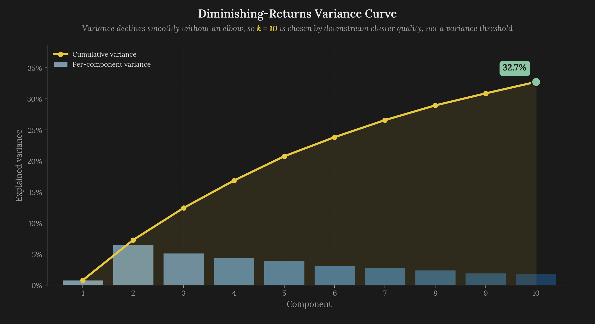  
*Figure 7: TruncatedSVD explained-variance curve across the **10** retained components. Per-component variance ratios decline smoothly from **PC2** at **6.48%** to **PC10** at **1.84%**, with **PC1** at only **0.80%**, because L2 normalization pushes the first component onto a near-constant direction shared across all postings. The cumulative curve crosses **32.7%** at **k = 10**, a number that is low in absolute terms but expected for unfiltered sentence embeddings.*

The first observation to make is that sentence embeddings are high-rank objects. Zhang, Zhou, and Bollegala[^53] found that PCA on sentence embeddings can absorb roughly **50%** dimensionality reduction (*from 768 down to ~384*) without measurable loss on downstream tasks, but preserving **95%** of variance would require on the order of **400-500** components on a model like gte-base-en-v1.5. The **10**-component target is a deliberate aggressive compression that trades variance preservation for clustering tractability and interpretability, and the empirical result is that **10** dimensions are enough for Ward linkage to recover a cluster structure that remains stable across refits and representational changes.

The second observation is that **PC1** carries only **0.80%** of the variance, which breaks the usual PCA intuition that the first component dominates. The reason is the L2 normalization step from the encoding stage, which rescales every posting embedding to the same length. With every posting sitting at the same distance from the origin, the first direction the SVD finds is the one all postings have in common, which is roughly the construction-industry vocabulary baseline they all share. Because every posting leans that way to about the same degree, projecting onto PC1 produces nearly the same number for all of them, and an axis that barely moves across the corpus is an axis that carries almost no distinguishing information. The axes that actually tell postings apart start at **PC2**. This pattern shows up reliably in scree plots on unit-length sentence embeddings, and it is worth knowing as a side-effect of the normalization choice, rather than a clustering failure.

### Interpreting the Principal Components

The remaining bulk of this section walks through what each of the **10** SVD components actually captures, because the interpretation clarifies downstream cluster identities and because this question landed consistently in class feedback. For each component, the pipeline takes the top **2.5%** and bottom **2.5%** of postings by projected coordinate, counts content-word tokens on each side filtered against a `wordfreq` Zipf-frequency cutoff and a WordNet synset-count threshold, and reports the differential token counts as the component's *positive* and *negative* loadings. The resulting per-component token lists are summarized in Figure 8 and walked through below.

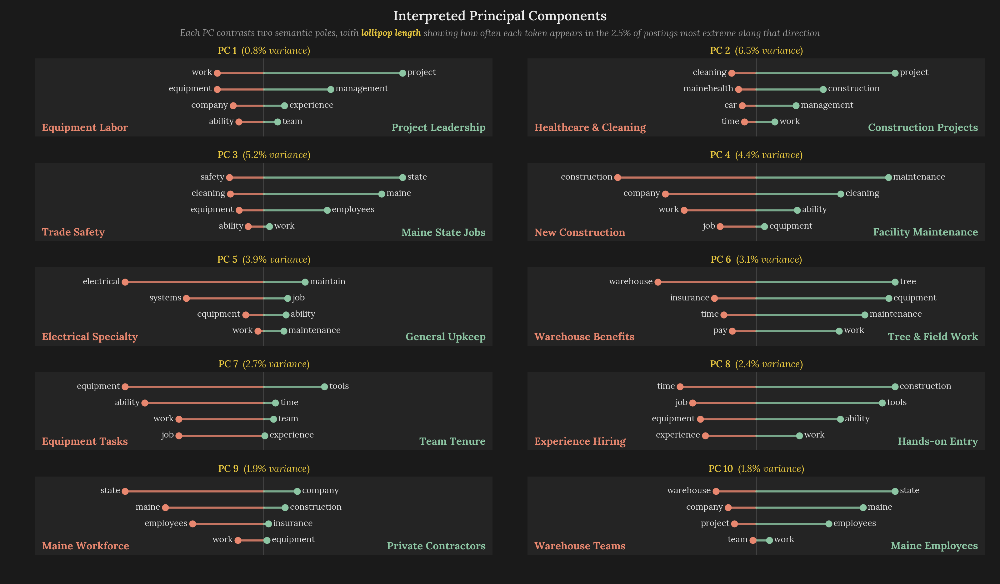  
*Figure 8: Top content tokens per pole for all **10** principal components, arranged as mini diverging lollipop charts in a two-column grid. Each lollipop's length encodes the raw count of that token across the top **2.5%** or bottom **2.5%** of postings along the component, scaled per-PC so the strongest loading on each side fills the bar. Positive-pole tokens appear on the right in green and negative-pole tokens on the left in salmon, with the named interpretation of each pole labeled in the bottom corners of every card and the PC number and variance share at the top. Read horizontally, the bar length shows pull, and a glance across the ten cards surfaces the token recurrence across poles that the following subsection ties to the anisotropic geometry of the underlying sentence embeddings.*

**PC1** (*variance **0.80%***) loads positively on *project*, *management*, *skills*, *projects*, *experience*, and *team*, whereas the negative side loads on *work*, *ability*, *equipment*, *company*, *time*, and *job*. Despite carrying the smallest variance share, the axis separates office-based project-management language from hands-on field-labor language. The reason the variance is small is that most postings are not firmly on one side or the other, because a typical construction foreman posting mentions both managing crews and using equipment, so the projection onto this axis lands near the origin for the majority of the corpus. The **Project Manager** and **Construction Managers** clusters sit on the positive side, whereas the **Construction Laborer**, **General Maintenance Workers**, and trade-specific clusters sit on the negative side.

**PC2** (*variance **6.48%***) is the first component where variance increases meaningfully, separating construction-project language (*project*, *construction*, *management*, *work*, *team*, *experience*) from service-and-maintenance language (*time*, *cleaning*, *mainehealth*, *car*, *vehicle*, *clean*). The **MaineHealth** token on the negative side is a giveaway that this axis captures the presence of non-construction facility-services postings in the corpus, which the clustering absorbs into the **General Cleaner** and **Environmental Services Team Member** clusters rather than allowing them to contaminate the trade-pure clusters.

**PC3** (*variance **5.15%***) captures a public-sector versus private-sector axis, with State of Maine and Maine DOT employment language (*state*, *maine*, *transportation*, *employees*, *work*, *employee*) on the positive side and OSHA-flavored trade vocabulary (*safety*, *equipment*, *cleaning*, *ability*, *maintenance*, *clean*) on the negative. The axis emerges, because **State of Maine** is the single largest employer in the corpus at **51** postings and the State of Maine prefix dominates their posting language. The **Transportation Engineers** and **Highway Maintenance Workers** clusters load positively on PC3, whereas the trade-pure clusters like **Electricians**, **HVAC Mechanics & Installers**, and **Welder** load negatively.

A facility-maintenance versus general-construction distinction shows up on **PC4** (*variance **4.41%***), with recurring-maintenance vocabulary (*maintenance*, *equipment*, *cleaning*, *ability*, *required*, *position*) on the positive side and job-posting logistics vocabulary (*work*, *construction*, *job*, *company*, *insurance*, *paid*) on the negative. This axis is the one that gives the **General Maintenance Workers** and **PT Sanitation Maintenance** clusters their distinct identity from the construction-proper clusters.

The strongest single-token loading in the top-10 components lives on **PC5** (*variance **3.91%***), where *electrical* pulls the negative side with a weight of **319** alongside *systems*, *experience*, *service*, *equipment*, and *work*, against a positive pole of generalist maintenance vocabulary (*ability*, *job*, *maintain*, *maintenance*, *duties*, *team*). The fact that electrical vocabulary is distinct enough from other trade vocabulary to claim its own SVD axis is why the **Electricians** cluster is one of the cleanest in the final clustering, surfacing a **+0.098** silhouette and a distinct cluster wage of **\$71,310**.

### PC6 through PC10: Narrower Vocabulary Effects and Redundant Axes

The remaining five components each isolate a narrower vocabulary effect rather than the clean "X trade vs. Y trade" separation an analyst might hope for. **PC6** (*variance **3.08%***) contrasts warehouse postings whose language emphasizes *time*, *insurance*, and *pay* with outdoor tree-and-field maintenance work whose tokens include *tree*, *equipment*, and *maintenance*, isolating benefits-forward warehouse postings from outdoor seasonal labor. **PC7** (*variance **2.74%***) separates equipment-and-ability task descriptions (*work*, *equipment*, *ability*, *job*) from time-in-role and team-tenure language (*time*, *experience*, *team*, *tools*), which isolates postings that foreground what-you-do from postings that foreground how-long-you-have. **PC8** (*variance **2.37%***) is closely related to PC7 but with the polarity flipped and the trade context more pronounced, contrasting experience-required hiring language (*experience*, *job*, *time*, *equipment*) with hands-on construction-entry vocabulary (*work*, *construction*, *tools*, *ability*). **PC9** (*variance **1.93%***) and **PC10** (*variance **1.84%***) both resolve into variants of the same State-of-Maine-versus-private-sector axis that PC3 captures with more variance, where PC9's private pole emphasizes insurance-backed construction firms (*company*, *construction*, *equipment*, *insurance*) and PC10's private pole emphasizes warehouse project teams (*warehouse*, *team*, *company*, *project*).

The overall shape of the reduction ends up uneven across these ten axes. The meaningful components (*PC2 through PC5*) peel off the coarse sector-scale distinctions the corpus actually contains, separating construction project work from cleaning-and-healthcare shifts, State-of-Maine employment from private-sector trade safety, new-build construction from recurring facility maintenance, and electrical specialty from generalist maintenance. The tail components (*PC6 through PC10*) either isolate narrower vocabulary effects like warehouse-benefits language or redundantly capture variants of earlier axes, with PC9 and PC10 both resolving into state-versus-private axes that PC3 already establishes. That unevenness follows directly from the anisotropic geometry the underlying sentence embeddings live in, which the next subsection makes explicit and which the clustering stage in [**Section 5**](#clustering-identity-and-wage) must navigate.

### Anisotropy and Token Reuse Across Components

Construction careers have high inherent skill overlap, because advancement in the trades means accumulating new competencies on top of a working set rather than switching to disjoint new ones, and the sentence encoder inherits that overlap as a geometric property of the posting embeddings themselves. An electrician who becomes a foreman keeps every wire-pulling competency and layers crew management on top, a journeyman who becomes a project manager keeps every field-level competency and layers scheduling and estimation on top, and the postings describing those roles accordingly share most of their vocabulary with the roles one rung below them. The token recurrence across poles, where *work*, *equipment*, *construction*, *maintenance*, *state*, and *maine* each appear on two or more components, is the surface signature of that overlap showing up at the representation level, compounded by a well-documented property of sentence-transformer embeddings that Ethayarajh[^66] and Li et al.[^67] document, wherein the pre-trained representation concentrates into a narrow cone of directions rather than distributing isotropically across the **768** dimensions the encoder exposes. When the input distribution is cone-shaped, the orthogonal axes that TruncatedSVD extracts do not cleanly partition distinct semantic themes, because each axis carries a projection of the shared cone plus a residual that promotes one occupational signal above the others. That is exactly what the PC6-PC10 redundancy above reveals, and it is why the same high-frequency construction vocabulary keeps appearing on the characteristic-token lists of supposedly orthogonal axes.

The same non-sphericity propagates into the clustering stage, wherein Ward-linkage clustering on top of cone-shaped SVD coordinates produces stable centroids (*because variance minimization is well-defined even on a non-Euclidean manifold*) but Euclidean silhouettes that land at **0.138** rather than at the above-**0.5** benchmark a spherical clustering produces, which is the score [**Section 5**](#clustering-identity-and-wage) walks through in detail. The hub-and-spoke topology the clusters surface, wherein a generalist hub absorbs foremen and multi-trade supervisors while trade-pure clusters peel off around the periphery, is the downstream shape of the same anisotropic geometry that forces token reuse across PCs. The SOC-assignment stage partly compensates by running ColBERTv2-style late-interaction MaxSim[^60][^61] on the full **768**-dimensional embedding rather than the reduced coordinates, so the resolution the SVD compression discards is available to the downstream matcher exactly where anisotropy would otherwise blur the match.

---

## Clustering, Identity, and Wage

Clustering is where the pipeline assembles a map from the reduced embedding space into named career families with concrete labor-market attributes. Each of the **20** clusters the final pipeline produces carries a human-readable label, a sector assignment, a Job Zone, a top-SOC anchor with full O\*NET Task and DWA elements attached, a softmax-weighted wage expectation drawn from BLS OEWS, and a within-cluster silhouette. The silhouette of **0.138** is low by the benchmarks clustering coursework usually teaches, but on this corpus it reads as an accurate reflection of the construction labor market's hub-and-spoke topology rather than a clustering failure.

### The Linkage Journey: Average Before the Embedding Migration, Ward After

The [early clustering investigation](https://github.com/Jybbs/chalkline/issues/8#issuecomment-4051970165) evaluated five clustering algorithms (*HAC, K-Means, DBSCAN[^22], HDBSCAN[^25], Mean Shift[^28]*) across silhouette[^29], Calinski-Harabasz[^21], Davies-Bouldin[^20], and Adjusted Rand Index[^24][^35] against three candidate label sources (*stakeholder sectors, SOC codes, and expert-coded subsets*) on the **922**-posting TF-IDF corpus that preceded the sentence-embedding migration. Three additional findings from that investigation are worth surfacing briefly. A document-frequency filtering experiment across eight configurations was reverted when the no-filter baseline won on every representation, a UMAP nonlinear manifold embedding sharpened fringe clusters but left the hub unchanged, and a Jaccard HAC alternative collapsed to a silhouette of **0.02**, because near-binary distances on the sparse skill matrix carried almost no geometric information. None of the methods broke the hub-and-spoke structure, and the topology persisted across every algorithmic and representational variant attempted, which is the pattern one would expect if the hub is a property of the data rather than a product of the clustering recipe. The hub is a **~800**-posting cluster absorbing generalist construction roles whose skills span multiple trades (*foremen, superintendents, project coordinators, general laborers*), and the spokes are smaller trade-pure clusters (*electricians, HVAC installers, welders, carpenters*) peeling off around the periphery.

Within that investigation, a three-way linkage comparison across Ward, complete, and average linkage evaluated cophenetic correlation following Sokal and Rohlf[^30] alongside silhouette, Calinski-Harabasz, and Davies-Bouldin on the TF-IDF and PCA coordinates then in use. Average linkage won three of the four metrics on that representation (*silhouette **0.36** against Ward's **0.20**, Davies-Bouldin **0.66** against Ward's **1.78**, cophenetic correlation **0.79** against Ward's **0.43**, with Ward holding only the Calinski-Harabasz column*), and the pipeline adopted average linkage for the middle phase of the project, because the numerical evidence under that representation pointed that way. Figure 9 preserves that scorecard as the period snapshot it was.

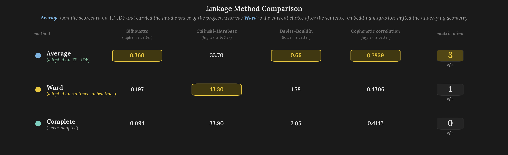  
*Figure 9: The three-way linkage comparison that ran during the early clustering investigation across silhouette (*higher is better*), Calinski-Harabasz (*higher is better*), Davies-Bouldin (*lower is better*), and cophenetic correlation (*higher is better*). Values are drawn from the **922**-posting TF-IDF and PCA corpus that preceded the sentence-embedding migration, and average linkage won three of the four metrics on that representation. The pipeline adopted average linkage accordingly, and Ward only later re-emerged as the current choice after the sentence-embedding migration re-ran the comparison on dense embeddings and found that average linkage collapsed into a **92%** hub under the new geometry.*

The [sentence-embedding migration](https://github.com/Jybbs/chalkline/pull/27) re-opened the linkage question (*see also the [orchestration and embedding rationale](https://github.com/Jybbs/chalkline/issues/13#issuecomment-4101808238) on the issue*), because the **768**-dimensional embeddings produced a geometry meaningfully different from the earlier TF-IDF and PCA space, and a re-evaluation across Ward, complete, and average linkage on the new coordinates produced a decisive reversal. Average linkage collapsed to a **92%** hub fraction on dense embeddings, because the smooth distance geometry of embedding space enables chaining behavior that concentrates almost every posting into a single cluster, whereas Ward's variance-minimization objective resists chaining and kept the largest cluster below **10%** of the corpus at **k = 20**. Ward[^27] was locked in from that migration forward for that reason and for the deterministic partition the downstream stages could depend on across refits[^15]. The stability property later proved load-bearing for the ColBERTv2-style MaxSim cluster-to-SOC assignment stage added in the [fast-follow pass](https://github.com/Jybbs/chalkline/pull/34), which scores each posting against individual O\*NET Task elements rather than against a cluster mean and so depends on the cluster boundary staying where it is from one refit to the next. Figure 10 shows the Ward-linkage dendrogram the current pipeline produces on those SVD coordinates, where the same hub-and-spoke topology the [early investigation](https://github.com/Jybbs/chalkline/issues/8) discovered on TF-IDF persists across the representation change.

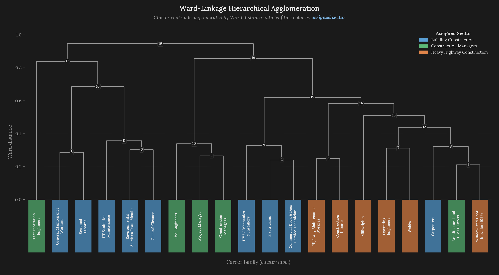  
*Figure 10: Ward-linkage hierarchical agglomerative dendrogram constructed on the **20** cluster centroids in SVD space, with leaves colored by their assigned sector. The tree has a three-way split at the top level that aligns roughly with the sector partition, with **Construction Managers** (*green*) clustering on the right, **Heavy Highway Construction** (*orange*) in the middle, and **Building Construction** (*blue*) on the left. The branch heights encode the variance gained by each merge, with the tallest merges separating the top-level sectors and progressively shorter merges inside each sector capturing finer trade distinctions.*

### Why k = 20

The cluster count **k = 20** was settled by a sweep over $`k \in \{10, 11, \ldots, 30\}`$ that evaluated silhouette[^29], Calinski-Harabasz[^21], and Davies-Bouldin[^20] on each candidate partition. The three metrics agreed on a Kneedle-style elbow around **k = 18-22**, with the exact location of the elbow sensitive to bootstrap resampling of the posting corpus, so **k = 20** landed in the center of the defensible range. The shape of the range also carries a readability consequence on either side, because fewer than **15** clusters collapses electricians and plumbers into a generic "interior trades" cluster that no apprenticeship coordinator can meaningfully target, and more than **25** fragments the lower-Job-Zone trades in ways that make the resulting map unreadable. The cluster count is exposed as `cluster_count` on `PipelineConfig` and can be re-fit at any value without code changes, so future programmatic needs can be met by a refit rather than a re-curation.

### Reading the Silhouette

The global [silhouette coefficient](https://en.wikipedia.org/wiki/Silhouette_(clustering)) for the final clustering is **0.138**, which is low in absolute terms and calls for explicit interpretation, because silhouette is the most commonly taught quality metric and its default reading does not apply here. Silhouette measures, for each sample $`i`$, the difference between its average distance $`a(i)`$ to points in its own cluster and its average distance $`b(i)`$ to points in the nearest other cluster:

$`
\hspace{0.5cm} \displaystyle
s(i) = \frac{b(i) - a(i)}{\max\bigl(a(i), b(i)\bigr)}
`$  
 

The coefficient normalizes to **+1** for perfect separation and **0** for cluster-boundary ambiguity. On datasets with spherical, well-separated clusters (*the Iris dataset, for example*), silhouette routinely lands above **0.5**. On the Chalkline clustering at **0.138**, the absolute number is well below that benchmark.

What the number reflects is that silhouette is *sensitive to the hub-and-spoke topology* the construction labor market exhibits, and that the hub cluster drags the global score down by design. Figure 11 shows the per-cluster silhouette distribution side-by-side with the cluster size distribution, and the pattern is that the trade-pure clusters have respectable silhouettes (**Transportation Engineers** at **+0.714**, **Construction Laborer** at **+0.288**, **Seasonal Laborer** at **+0.287**, **Millwrights** at **+0.234**, **General Cleaner** at **+0.211**), whereas the generalist clusters have silhouettes near zero (**Architectural and Civil Drafters** at **-0.004**, **Commercial Dock & Door Service Technician** at **+0.028**, **Highway Maintenance Workers** at **+0.042**). The cluster-level pattern is that within-sector silhouettes are positive, cross-sector silhouettes are near zero, and the global mean is dragged down by the generalist clusters that sit at sector boundaries. The Construction Managers sector average at **+0.239** is the highest of the three sectors.

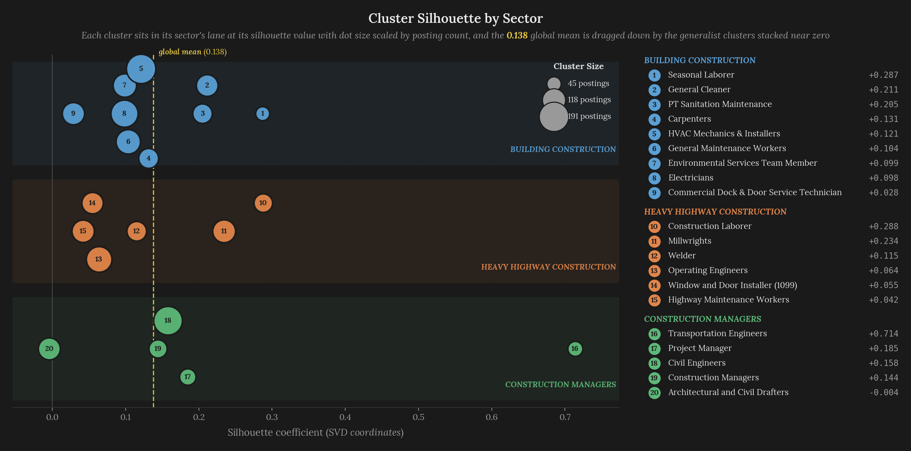  
*Figure 11: Left panel: per-cluster silhouette coefficients colored by sector, with the global mean at **0.138** marked by the dashed line. Silhouettes range from **-0.004** (*Architectural and Civil Drafters*) to **+0.714** (*Transportation Engineers*). Right panel: cluster sizes, where the largest cluster (*HVAC Mechanics & Installers at **191** postings*) is **4.2×** the smallest (*Seasonal Laborer at **45** postings*). The generalist clusters drag the global silhouette down, whereas the trade-pure clusters land where one would expect a well-supported cluster to sit.*

Read in that light, the **0.138** silhouette reads as an accurate score for the topology the data actually carries. Supervisory roles, foremen, and generalist laborers share skill breadth across trades, so their projections sit in the interior of the manifold and their cluster boundaries are fuzzy. A clustering that produced silhouettes above **0.5** on this corpus would imply trade pools with no shared vocabulary, which is not the world construction workers actually move through, and the same skill-overlap property that makes the careers traversable as paths in the first place is what the silhouette score is registering at the cluster-boundary level.

### Cluster Sizes and Sector Distribution

The **20** clusters partition into the three stakeholder-defined sectors. The **Building Construction** sector contains **9** clusters with **1,041** total postings and an average median wage of **\$56,567**. The **Construction Managers** sector contains **5** clusters with **476** total postings and an average median wage of **\$79,660**, the highest of the three. The **Heavy Highway Construction** sector contains **6** clusters with **637** total postings and an average median wage of **\$57,700**. Cluster sizes range from **45** postings (*Seasonal Laborer*) to **191** postings (*HVAC Mechanics & Installers*), with the largest cluster being **4.2×** the smallest. The posting distribution ends up close to balanced across sectors in proportion to the curated SOC count per sector, which is a consequence of the Ward-linkage variance objective rather than an input to the clustering.

Figure 12 presents the full cluster roster as a single at-a-glance reference table, with every cluster's sector, Job Zone, posting count, wage expectation, and silhouette on one page. The figures on either side of the roster (*Figure 11 for silhouette detail, Figure 13 for the SOC softmax heatmap, and Figure 14 for wage distributions by sector*) all reference the same **20** clusters, and the roster gives the reader a single place to re-orient to cluster identity without flipping between the surrounding visualizations.

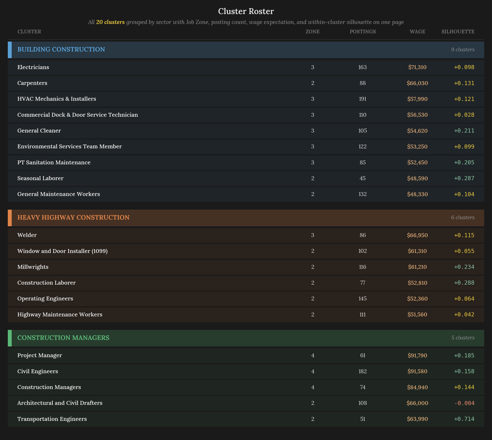  
*Figure 12: The fitted pipeline\'s **20** career families grouped by sector and then sorted by wage, with each sector block tinted in its sector's color and introduced by a bolder header band. Each row shows the cluster label, Job Zone, posting count, BLS-softmax wage expectation, and silhouette coefficient. Silhouette values are colored green above **0.15**, gold between **0** and **0.15**, and red below **0**. Wage expectations range from **\$48,330** (*General Maintenance Workers*) to **\$91,790** (*Project Manager*). The roster serves as the canonical cross-reference for each cluster's attributes wherever a cluster is named elsewhere in the document.*

The Job Zone column in Figure 12 shows the **20** clusters distributed across Zones 2 through 4 only, with **10** clusters at Zone 2, **7** clusters at Zone 3, and **3** clusters at Zone 4, while Zones 1 and 5 sit in the lexicon without claiming a cluster of their own. Both absences are the same phenomenon acting on opposite ends of the tree, and both trace back to the [**anisotropy section's**](#anisotropy-and-token-reuse-across-components) shared-cone finding. Zone 1 occupations (*the little-preparation tier*) and Zone 5 occupations (*the advanced-professional tier*) each combine many competencies rather than concentrating a distinct new one. Zone 1 roles overlap heavily with the generalist-labor end of Zone 2, while Zone 5 roles overlap heavily with the supervisory end of Zone 4. Bottom-up agglomerative clustering is designed to find dense concentrations in the embedding space, and when the data is cone-shaped in the way sentence-transformer embeddings are, the boundaries at the top and bottom of the tier ladder blend into their Zone-2 and Zone-4 neighbors rather than concentrating into their own clusters. The **5** Zone 1 SOCs and the **2** Zone 5 SOCs the lexicon does carry consequently never score as the MaxSim-nearest SOC for any cluster, because no cluster's member postings collectively resemble either the little-preparation or the advanced-professional end of the taxonomy. The practical consequence for the career map is that the upward edges [**Section 6**](#pathways-graph-construction-and-credential-selection) constructs move from Zone 2 to Zone 3 and from Zone 3 to Zone 4 only, with no edges reaching into Zone 1 or Zone 5 territory even though the O\*NET taxonomy supports them, which is the agglomerative-ceiling consequence of the same overlap that makes the lower rungs traversable as paths.

### SOC Assignment: Centroid-to-Centroid Cosine Was Not Enough

With the partition in hand, the next stage maps each cluster to an O\*NET Standard Occupational Classification code and inherits the SOC's Job Zone, its Task and DWA elements, and through the labor join its wage distribution. The initial implementation computed cosine similarity between the cluster's mean embedding and each candidate SOC's mean embedding (*where the SOC mean was itself the mean of the sentence-encoded Task elements plus the DWA elements plus the top KSA elements*), then assigned the SOC with the highest similarity. Both this step and the MaxSim step that replaced it operate on the full **768**-dimensional embedding space rather than the [**10**-dimensional SVD reduction](#representation-encoding-and-reduction) the clustering stage consumes, because late-interaction matching benefits from the embedding resolution the compression discards. This centroid-to-centroid approach produced coarse assignments that worked for trade-pure clusters but routinely misassigned borderline clusters whose member postings spanned two SOCs in ways that the cluster mean hid.

The worked example that surfaced the problem was the cluster eventually labeled **HVAC Mechanics & Installers**. Its member postings split roughly **60-40** between pure-HVAC roles and facility-maintenance roles that include HVAC troubleshooting alongside other systems. The cluster mean sat in between those two SOCs' means, and the centroid-to-centroid match assigned the cluster to **Maintenance and Repair Workers, General**, absorbing its HVAC identity into a generic maintenance category. The same pattern affected the **Electricians** cluster (*which partially resembled HVAC Mechanics on the centroid metric*) and the **Welder** cluster (*which partially resembled Millwrights*).

### ColBERTv2 MaxSim for Cluster-to-SOC Assignment

The replacement the pipeline adopted is a ColBERTv2-style late-interaction MaxSim operator[^60][^61] that scores each individual posting in a cluster against each individual Task element in a candidate SOC. The [aggregation trade-off](https://github.com/Jybbs/chalkline/pull/32) between pooled scoring and max-based scoring is documented in full alongside the original implementation, with pooled concat scoring favoring broad-role clusters and max-based scoring favoring narrow-specialty clusters. Let $`P_c`$ be the postings in cluster $`c`$, $`T_s`$ the Task elements of candidate SOC $`s`$, and $`\mathbf{v}_p, \mathbf{v}_t \in \mathbb{R}^{768}`$ the L2-normalized embeddings. The operator is:

$`
\hspace{0.5cm} \displaystyle
\begin{aligned}
\text{sim}(p, s) &= \max_{t \in T_s} \cos(\mathbf{v}_p, \mathbf{v}_t) \\
\text{score}(c, s) &= \frac{1}{|P_c|} \sum_{p \in P_c} \text{sim}(p, s)
\end{aligned}
`$
 

The inner $`\max`$ picks the most-similar Task element for each posting, and averaging over the cluster's postings gives the cluster-level score for that SOC. Where this formulation departs from centroid-to-centroid cosine is in the max-inner step, wherein a posting that closely matches one Task element (*even if other Task elements do not match that posting well*) still contributes its best-element similarity to the cluster score, so the SOC assignment reflects the actual distribution of matching elements rather than a centroid average that hides those matches. Limiting the element pool to Task text only is deliberate, because task-level specificity is what discriminates adjacent trades whose aggregated descriptions otherwise blur together under pooled scoring, and broadening into DWA and KSA elements dilutes the signal that pulls *Electricians* out from *HVAC Mechanics & Installers* in the cluster-boundary region.

Running the MaxSim assignment over all **20** clusters and all **60** SOCs produces a **20 × 60** similarity matrix that feeds three downstream purposes:

- The **nearest-SOC assignment** is the argmax over the SOC axis, and it sets each cluster's anchor SOC alongside its display title, Job Zone, and Task-element list
- The **wage-weighted distribution** is a softmax over each row that produces a top-3 SOC distribution, which drives the wage rollup and the sector vote
- The **credential relevance** ranking reuses the same per-cluster affinities to determine which credentials count as destination-relevant in [**Section 6**](#pathways-graph-construction-and-credential-selection)

The softmax that produces the per-cluster SOC weights restricts to the top-**K** SOCs for each cluster (*`soc_wage_topk = 3`*) and applies temperature $`\tau`$ to the sharpening:

$`
\hspace{0.5cm} \displaystyle
w_i(c) = \frac{\exp(\text{score}(c, s_i(c)) / \tau)}{\sum_{j=1}^{K} \exp(\text{score}(c, s_j(c)) / \tau)}
`$  
 

where $`s_i(c)`$ is the $`i`$-th-ranked SOC for cluster $`c`$. The weights sum to $`1`$ over the top-$`K`$ neighbors by construction, and the temperature $`\tau = 0.02`$ sharpens the distribution so that trade-pure clusters concentrate most of their top-3 mass on the single nearest SOC (*General Maintenance Workers at **0.56**, General Cleaner at **0.53**, Environmental Services Team Member at **0.52***) while cluster-boundary cases (*like **HVAC Mechanics & Installers** straddling the maintenance-vs-install boundary at **0.30** on its top SOC*) split across two or three neighboring SOCs and inherit a blended wage rather than snap to one SOC's median.

### The Display-Title Cascade

The argmax-nearest-SOC assignment solves half the labeling problem but not the other half, because multiple clusters routinely land on the same nearest SOC. In the current fit, **five** clusters are all nearest to the `General Maintenance Workers` SOC, **three** share `Millwrights`, and three more pairs share `HVAC Mechanics & Installers`, `Civil Engineers`, and `Operating Engineers`. A shared label across clusters would collide the career map's dropdowns, the resume matcher's lookups, and the dendrogram leaf set onto identical strings that no downstream surface can distinguish.

The `display_titles` cascade resolves those collisions by picking the shortest unique human-readable label per cluster across a fixed three-level ladder:

$`
\hspace{0.5cm} \displaystyle
\ell(c) = \begin{cases} \text{soc\_title}(c) & \text{if unique at level 0} \\ \text{modal\_title}(c) & \text{if unique at level 1} \\ \text{soc\_title}(c) \; + \; \text{``(\#''} + \text{id}(c) + \text{``)''} & \text{otherwise} \end{cases}
`$  
 

Two earlier cascade designs failed before this one landed, and the [three-iteration history](https://github.com/Jybbs/chalkline/pull/32) documents why picking the runner-up SOC and why simple modal-title tiebreakers both left collisions unresolved. The cascade runs as a three-pass fixpoint where each pass groups clusters by their current label, and in any group that contains more than one cluster the largest cluster keeps its current level while the smaller ones advance to the next. The five-way `General Maintenance Workers` collision resolves to the largest cluster (*size **132***) keeping the bare SOC title while the other four advance to modal posting titles drawn from their own member postings, producing **Environmental Services Team Member**, **General Cleaner**, **PT Sanitation Maintenance**, and **Seasonal Laborer**. The Millwrights-nearest trio follows the same cascade, with the second-largest becoming **Window and Door Installer (1099)** from its freelance-contractor postings and the third becoming **Welder**, because that is the modal title of its member set despite Millwrights being the nearest SOC. Clusters that claim a SOC uniquely (*Electricians, Carpenters, Architectural and Civil Drafters, Highway Maintenance Workers, Construction Managers, Transportation Engineers*) stay at the bare title and never advance. No cluster in the current fit reaches the third-level fallback, but the mechanism guarantees uniqueness even when two clusters would otherwise share both a SOC title and a modal posting title. The result is a label set that every downstream surface (*dendrogram leaves, graph nodes, roster rows, resume-match dropdowns*) can treat as a primary key without additional disambiguation, and it is the reason a reader of [Figure 10](#clustering-identity-and-wage) sees a mix of bare occupational titles and more granular posting-level names rather than numbered cluster IDs.

### The Softmax Temperature Investigation

The softmax temperature $`\tau`$ that converts the **20 × 60** similarity matrix into a weight distribution controls how concentrated the wage-rollup weight is on the top-1 SOC versus spread over the top-3. A temperature too high (*uniform weighting*) drowns the weighted wage in noise from low-affinity SOCs. A temperature too low (*sharp concentration on the argmax*) collapses to single-SOC behavior and loses the advantage of the softmax in the first place.

A [thirty-variant investigation](https://github.com/Jybbs/chalkline/issues/39#issuecomment-4261266161) swept across six scoring strategies (*top-1 selection, full-softmax-sum weighting, size-normalized mass, top-K weighted voting, re-softmax across multiple temperatures in $`\{0.005, 0.01, 0.02, 0.05, 0.1, 0.2, 0.5, 1.0\}`$, and runner-up guards*) and compared each variant's sector-resolution output against the stakeholder's three-sector target. The result was counterintuitive, because no variant surfaced Construction Managers as a third sector under the baseline lexicon, and the softmax at $`\tau = 0.02`$ already concentrated most of each cluster's mass on the single argmax SOC so a soft vote could not overturn an argmax whose own curated sector was the misassigned one. The stopping point in the investigation came with the recognition that the remaining error was curational rather than algorithmic, because the misassignments that the softmax failed to fix were cases where the cluster's nearest SOC sat outside the **21**-SOC stakeholder lexicon. Expanding the lexicon from **21** to **60** SOCs and adding the **42**-entry stakeholder override file under `data/stakeholder/additions/` (*detailed in [**Section 3**](#data-layer-corpus-and-lexicons)*) resolved the remaining misassignments, and the softmax at $`\tau = 0.02`$ stayed as the final setting.

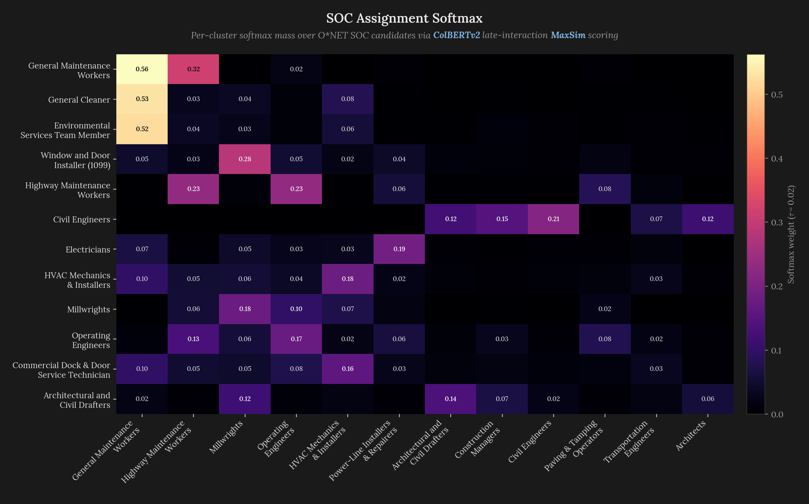  
*Figure 13: Softmax-weighted assignment mass over the top clusters and top candidate SOCs at temperature $`\tau = 0.02`$. Row ordering is by the cluster's top-SOC mass concentration, column ordering is by total mass summed across clusters. Cluster rows whose top-SOC mass exceeds **0.5** (*General Maintenance Workers at **0.56**, General Cleaner at **0.53**, Environmental Services Team Member at **0.52***) sit at the top, concentrating the majority of their assignment weight on a single SOC. Cluster rows with more distributed mass (*HVAC Mechanics & Installers with **0.30** / **0.18**, Commercial Dock & Door Service Technician with **0.10** / **0.16**, Operating Engineers with **0.13** / **0.17***) split weight across two or three neighboring SOCs, which is the intended behavior for trade-adjacent clusters whose postings legitimately span multiple O\*NET categories rather than fitting one cleanly.*

### The Wage Rollup

Each cluster inherits a wage expectation via the top-**3** SOC softmax weights. Let $`s_i(c)`$ denote the $`i`$-th-ranked SOC for cluster $`c`$, $`w_i(c)`$ its softmax weight, and $`\text{median}_\text{BLS}(s)`$ the BLS OEWS median annual wage for SOC $`s`$. The rollup is:

$`
\hspace{0.5cm} \displaystyle
\begin{aligned}
\text{wage}_\text{raw}(c) &= \sum_{i=1}^{3} w_i(c) \cdot \text{median}_\text{BLS}(s_i(c)) \\
\text{wage}(c) &= \text{round}\bigl(\text{wage}_\text{raw}(c), \$10\bigr)
\end{aligned}
`$
 

Rounding to the nearest **\$10** gives the display layer a stable number that does not visually fluctuate by single dollars across refits. The wages range from **\$48,330** (*General Maintenance Workers*) to **\$91,790** (*Project Manager*), with the Construction Managers sector dominating the top end of the distribution.

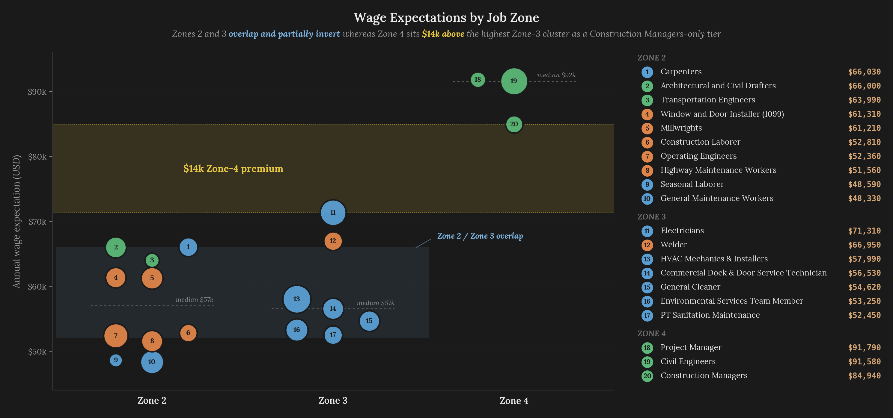  
*Figure 14: Cluster-level wage expectations organized by sector, with individual clusters labeled and scaled by posting count. The Construction Managers sector (*green violin, right*) has the highest average cluster wage at **\$79,660** and contains the three highest-paying clusters (*Project Manager at **\$91,790**, Civil Engineers at **\$91,580**, Construction Managers at **\$84,940***). The Heavy Highway Construction sector (*orange, center*) has a tighter wage distribution centered on an average of **\$57,700**. The Building Construction sector (*blue, left*) has the widest wage spread, reflecting the range from General Maintenance Workers at **\$48,330** to electricians at **\$71,310**.*

The **20** clusters now carry names, sectors, Job Zones, SOC anchors, and wage expectations, which is enough structure for the graph-construction stage to begin treating them as nodes. What the cluster attributes do not yet supply are the directed relationships that turn a node set into a map, and the Job Zone ordering the clustering stage inherited from O\*NET is what the next stage will use to impose direction on otherwise-symmetric nearest-neighbor edges.

---

## Pathways: Graph Construction and Credential Selection

Pathways is where Chalkline turns the **20** clusters into a directed career map and attaches credential stacks to each advancement edge, assembled as two layers. The first layer is the **career graph**, a directed graph with **20** nodes and **96** edges (*62 lateral and 34 upward*) constructed by stepwise k-NN over the SVD coordinates with Job Zone gating. Sitting on top of that graph, the second layer is the **credential stack** per edge, selected by a waste-aware Pareto-knee procedure over the **836**-entry credential catalog with a destination-affinity filter that prevents topic drift. Both layers derive from the same geometry the clustering stage produced, meaning no separate similarity model is fitted for pathway construction and every edge in the final artifact has a reproducible provenance.

### Stepwise k-NN with Job Zone Gating

Construction of the graph iterates over each cluster and, for each cluster, finds its nearest neighbors at the same Job Zone and at the next Job Zone. The k-NN operates on the same SVD coordinates the [**clustering stage**](#clustering-identity-and-wage) uses, which means the hub-and-spoke topology the silhouette section defends becomes visible here as the edge density around the generalist clusters at the center of the manifold, because the skill overlap that makes careers traversable is what produces the close nearest-neighbor relationships the k-NN step recovers as edges. Same-Zone neighbors become **lateral edges**, encoding career moves between trades at comparable experience levels, and next-Zone neighbors become **upward edges**, encoding advancement moves into higher-qualification work. Let $`\text{kNN}_z(c, k)`$ return the $`k`$ nearest clusters to $`c`$ among those at Job Zone $`z`$ under Euclidean distance in SVD space. The edge set $`E`$ decomposes as:

$`
\hspace{0.5cm} \displaystyle
\begin{aligned}
E_{\text{lat}} &= \{(c_i, c_j, \text{lateral}) : c_j \in \text{kNN}_{\text{zone}(c_i)}(c_i, k_{\text{lat}})\} \\
E_{\text{up}} &= \{(c_i, c_j, \text{upward}) : c_j \in \text{kNN}_{\text{zone}(c_i)+1}(c_i, k_{\text{up}})\} \\
E &= E_{\text{lat}} \cup E_{\text{up}}
\end{aligned}
`$
 

where $`k_{\text{lat}} = 2`$ and $`k_{\text{up}} = 2`$ are the configurable neighbor counts exposed on `PipelineConfig`, and the k-NN is computed on the SVD-reduced coordinates using Euclidean distance. Lateral edges are bidirectional (*if $`c_j`$ is a lateral neighbor of $`c_i`$, then $`c_i`$ is also a lateral neighbor of $`c_j`$*), whereas upward edges are unidirectional (*the pipeline records advancement from $`c_i`$ to $`c_j`$ but not the reverse*). The final graph has **62** lateral edges and **34** upward edges for **96** edges total.

The Job Zone gating is what makes the graph legible as an advancement map, rather than as an undirected similarity network. O\*NET's Job Zone taxonomy ranks occupations on a five-level scale from Zone 1 (*little preparation needed*) through Zone 5 (*extensive preparation needed*), and the Chalkline clusters populate **Zones 2, 3, and 4**. By restricting upward edges to exactly the next Zone above a source cluster's Zone, the pipeline avoids suggesting single-step advancement from entry-level laborer roles directly to senior engineering roles, which would be a technically valid nearest-neighbor relationship but a misleading career recommendation. Acyclicity is guaranteed by a strict total order on clusters:

$`
\hspace{0.5cm} \displaystyle
c_i \prec c_j \iff \text{zone}(c_i) < \text{zone}(c_j) \;\lor\; \left(\text{zone}(c_i) = \text{zone}(c_j) \land \text{id}(c_i) < \text{id}(c_j)\right)
`$  
 

with upward edges required to point from $`c_i`$ to $`c_j`$ only when $`c_i \prec c_j`$ and the zones differ by exactly one. Lateral edges live entirely within a single zone and are recorded bidirectionally, so the directed projection that drives advancement traversals never contains a cycle, because every upward edge strictly increases the zone component of the order.

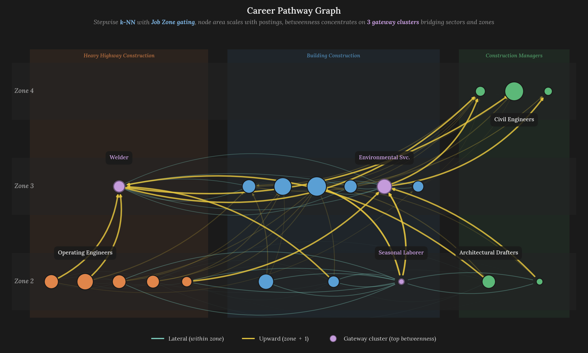  
*Figure 15: The fitted career graph with **20** cluster nodes and **96** edges. Horizontal position encodes median annual wage (*from **~\$48,000** on the left to **~\$92,000** on the right*) and vertical position encodes Job Zone (*2, 3, and 4*). Node color encodes the stakeholder-defined sector, with **Building Construction** in blue, **Heavy Highway Construction** in orange, and **Construction Managers** in green. Edge color encodes kind, with **teal** for the **62** bidirectional lateral edges and **gold** for the **34** unidirectional upward advancement edges. Node size encodes posting count per cluster.*

### Betweenness Centrality: Gateway Clusters

With the graph in place, the pipeline computes Freeman's [betweenness centrality](https://en.wikipedia.org/wiki/Betweenness_centrality)[^49] on each node to identify which clusters function as gateways between otherwise-disconnected regions of the map. Let $`V`$ be the cluster set, $`\sigma_{st}`$ the number of shortest paths from $`s`$ to $`t`$, and $`\sigma_{st}(v)`$ the number of those paths passing through $`v`$. Betweenness is the fraction of all shortest paths that pass through a given node:

$`
\hspace{0.5cm} \displaystyle
B(v) = \sum_{s, t \in V,\, s \neq v \neq t} \frac{\sigma_{st}(v)}{\sigma_{st}}
`$  
 

A high score indicates that removing the node would disconnect or lengthen many routes. The top three gateway clusters are **Seasonal Laborer** (**0.082**), **Environmental Services Team Member** (**0.073**), and **Welder** (**0.073**), followed by **Commercial Dock & Door Service Technician** (**0.056**), **Window and Door Installer (1099)** (**0.044**), and **Highway Maintenance Workers** (**0.044**). The gateway structure surfaces exactly the clusters a stakeholder should invest in if the goal is to shorten the typical path between sectors. Seasonal Laborer bridges the Building Construction and Heavy Highway sectors at Zone 2, Welder bridges Heavy Highway and Building Construction at Zone 3, and Environmental Services Team Member connects facility-maintenance and construction-trade clusters within Building Construction.

### Three Failed Credential Pickers

Attaching credentials to edges turned out to be the hardest stage of the pipeline to get right, and three implementation attempts failed before the fourth succeeded. The first attempt used **top-k by raw similarity**, where for each destination cluster the pipeline ranked the **836** credentials by cosine similarity to the cluster centroid and took the top **5**. That produced plausible-looking lists but had no coverage guarantee, wherein the top credentials frequently clustered on a single skill axis (*five OSHA safety cards for any cluster that mentions scaffolding*) while leaving other skill areas uncovered. The second attempt used **Jaccard overlap on O\*NET skill tokens**, computing for each credential the Jaccard similarity between its embedding-extracted tokens and the destination cluster's SOC Task tokens. That worked slightly better but lost the embedding-space geometry the rest of the pipeline relied on, and the Jaccard computation proved sensitive to tokenization choices the rest of the pipeline had moved past. The third attempt used a **coverage-only greedy set cover**, selecting credentials to maximize the number of covered task gaps without any penalty for waste. That produced stacks which covered the destination well but included credentials whose topic drift was severe, wherein a roofing credential would appear on a Civil Engineers path, because its embedding happened to overlap one engineering-adjacent task.

### The Waste-Aware Pareto-Knee Selector

The fourth selector, whose [implementation and rationale](https://github.com/Jybbs/chalkline/pull/36) document the full design and whose [Walt Amper visual review](https://github.com/Jybbs/chalkline/issues/35#issuecomment-4256980671) surfaced the work-based-path overlap that motivated the fix, frames credential selection as a [multi-objective optimization](https://en.wikipedia.org/wiki/Pareto_front) over the trade-off between **coverage** (*task gaps filled*) and **waste** (*credential content that does not address any gap*). Let $`\mathcal{C}`$ be the **836**-entry filtered candidate pool, $`C \subseteq \mathcal{C}`$ a selected stack, $`G`$ the destination's task-gap set, and $`\text{covered}(c)`$ the set of Task elements whose embedding cosine-similarity to credential $`c`$ exceeds that credential's own median. Coverage $`\rho(C)`$ and waste $`\omega(C)`$ of a stack are then:

$`
\hspace{0.5cm} \displaystyle
\begin{aligned}
\rho(C) &= \frac{\left|\bigcup_{c \in C} \text{covered}(c) \cap G\right|}{|G|} \\
\omega(C) &= \sum_{c \in C} \left|\text{covered}(c) \setminus G\right|
\end{aligned}
`$  
 

Coverage is the fraction of destination gaps that at least one selected credential addresses, and waste is the total count of covered-but-off-topic elements summed across the stack. Candidate stacks arise from sweeping a waste-penalty $`\alpha`$ across the filtered pool, where each step runs a greedy pass that picks credentials by the incremental score:

$`
\hspace{0.5cm} \displaystyle
\text{score}(c \mid R) = \Delta\rho(c, R) - \alpha \cdot \Delta\omega(c, R)
`$  
 

Here $`\Delta\rho(c, R)`$ is the number of new gaps credential $`c`$ covers beyond the current residual $`R`$, and $`\Delta\omega(c, R)`$ is the number of positions in $`c`$'s reach that land on already-covered or non-gap tasks. The selector then proceeds in five steps. First, the selector computes the destination cluster's task gaps, meaning the Task and DWA elements for the cluster's nearest SOC whose similarity to the source cluster's centroid lies below the median. Second, it filters $`\mathcal{C}`$ by a **destination-affinity** criterion $`\cos(\mathbf{c}, \mathbf{d}) \geq \tau_\text{dest}(\mathbf{d})`$, where $`\tau_\text{dest}(\mathbf{d})`$ is the **80th** percentile of that credential's own cluster affinities (*equivalent to asking: "is this credential at least reasonably associated with this destination, relative to other destinations?"*). Third, for each sweep value of $`\alpha`$ it runs a greedy pass under the scoring rule above, building a stack of size up to **5** and computing the $`(\rho(C), \omega(C))`$ pair for that stack. Fourth, it identifies the Pareto frontier over those points, meaning the set of subsets $`\{C : \nexists\, C' \text{ with } \rho(C') \geq \rho(C) \text{ and } \omega(C') \leq \omega(C) \text{ strictly}\}`$. Fifth, it applies [Kneedle](https://doi.org/10.1109/ICDCSW.2011.20)[^26] to the Pareto frontier to locate the knee point where additional coverage starts to cost disproportionate waste, and it returns the subset at the knee as the selected stack. A coverage-floor fallback returns the subset with the highest coverage whose coverage meets the floor (*default **80%***) if no knee exists on the frontier.

The worked example the selector exercises end to end takes the **General Cleaner** destination (*cluster id **13**, Job Zone **3**, sector Building Construction*) drawn from its source cluster at the previous Job Zone. The gap computation identifies **36** missing tasks out of the General Cleaner SOC's **66** Task and DWA elements, and the destination-affinity filter keeps **168** of the **836** credentials as eligible candidates. Sweeping $`\alpha`$ across the candidate pool produces a Pareto frontier of **6** non-dominated $`(\rho, \omega)`$ points, and Kneedle picks the knee at **32 of 36** gaps covered with **33** waste elements. The selected stack combines the Building Construction program with two reinforcing certifications (*Certified Maintenance Employee, Construction Equipment Operator*) to reach that coverage-waste balance.

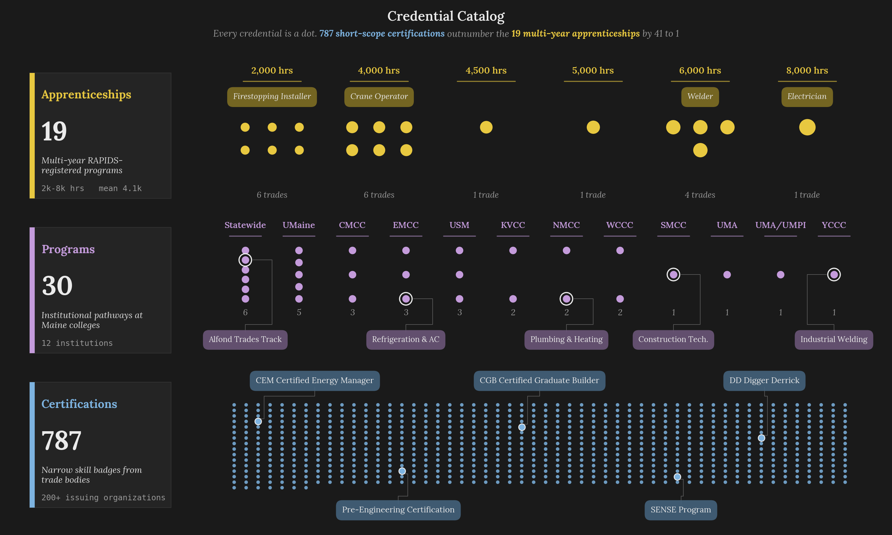  
*Figure 16: Left panel: composition of the **836**-entry credential catalog, split into **19** apprenticeships (**2.3%**), **787** certifications (**94.1%**), and **30** programs (**3.6%**). Right panel: representative credential samples from each kind, showing the label and sponsoring organization for twelve entries across the three categories. The apprenticeships carry RAPIDS program codes, the certifications span OSHA, NCCER, and manufacturer-specific programs, and the programs cover community-college and university degrees at the certificate, associate, and bachelor's levels.*

### The Frontier and the Knee

Figure 17 lays out the frontier one row per candidate stack, sorted top-to-bottom by ascending coverage. Each row shows the destination's task gaps as two-tone tiles that fill as the stack covers them, alongside a parallel strip of **amber** waste tiles. The first **29** gap columns are **required**, because 80% of **36** gap tasks is the coverage floor a stack must clear to qualify, and the remaining **7** columns are **bonus coverage** past the floor. A vertical dotted line marks the boundary between the two regions. Reading top to bottom, the required green saturates while the amber accelerates, and the knee is the row where one more filled tile would cost several more amber ones, which is the trade-off the waste-aware selector balances.

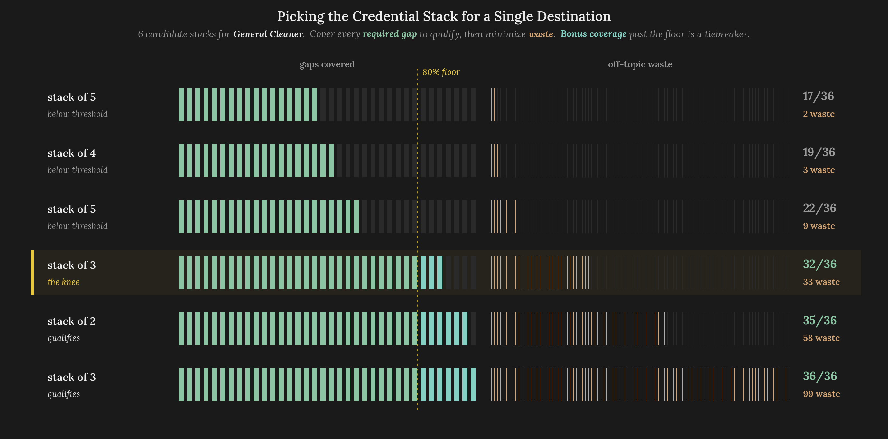  
*Figure 17: Every Pareto-frontier candidate stack for the **General Cleaner** destination (*Job Zone 3, **36** gap tasks*). Each row is one stack. **Green** tiles mark filled **required** gaps, **teal** tiles mark **bonus coverage** past the 80% floor, and **amber** tiles mark off-topic waste. The gold dotted line marks the coverage-floor boundary. The top three rows fail the floor with efficient low-waste stacks that do not cover enough, the fifth and sixth rows climb toward full coverage but drag in 58 and 99 waste tasks respectively, and the **gold-highlighted fourth row** is the knee where Kneedle picks: **32 / 36** gaps covered with **33** waste, because the next rows nearly double waste each for only three and then one additional gaps.*

The waste-aware framing earns its place over a coverage-only greedy set cover, because the credential recommendations appear to a real user who has to spend real time and money acquiring them. A coverage-only cover might recommend five credentials that collectively address every task gap but individually waste **50-70%** of their content on tasks the destination does not care about, which disrespects the user's time budget even when the coverage number looks good. The Pareto-knee approach instead picks the stack that covers the destination well while staying tight to the destination's actual skill footprint, which is what that time budget warrants.

### Destination Affinity as a Topic-Drift Filter

Topic drift is kept in check by the **80th-percentile destination-affinity filter** sitting in front of the selector. Without it, the pure coverage-versus-waste optimization would happily select a credential whose highest similarity is to an unrelated cluster as long as it marginally covers some gaps on the target, producing the roofer-credential-on-civil-engineer-path pathology the third failed selector exhibited. The filter asks a stricter question of whether the credential's top affinity sits near this destination, and it rejects the credential if the destination is not in the top **20%** of its affinities. The **80th percentile** threshold is exposed as `destination_percentile` on `PipelineConfig` and can be loosened for sparse destinations or tightened for high-precision applications.

### Graph Layer Caching

Graph construction and betweenness computation run inside Hamilton's `graph` node and cache against the upstream `clusters` and `credentials` node versions, while the Pareto-knee credential selection runs per call at interaction time through `credentials_for(target_id)` so each destination a user clicks on picks up a freshly computed stack. Changing `lateral_neighbors`, `upward_neighbors`, or `destination_percentile` on the config invalidates only the `graph` node, whereas changing `cluster_count` or `component_count` invalidates upstream nodes that cascade down to the graph through their version hashes. The [**engineering section**](#engineering-infrastructure) in Figure 19 shows exactly which nodes re-run for each config-field change.

---

## Resume Matching and Gap Analysis

Resume matching is the last stage of the pipeline and the one the end-user interacts with most directly. An uploaded PDF enters the Marimo application, gets its text extracted, projects through the fitted SVD basis, lands in the nearest cluster, and produces a per-task gap analysis against that cluster's SOC Task and DWA elements. The two advancement candidates the career graph identifies surface alongside with their own per-task previews, so the output carries four layers at once:

- The **cluster identity** is the career family the resume lands in
- The **demonstrated competencies** are the family's tasks the resume already shows evidence for
- The **gap tasks** are the family's tasks the resume does not yet cover
- The **advancement previews** are the two upward destinations from the career graph and the additional tasks each would require

Taken together the report reads like a career coach walking the user through where they are, what they have, what they are missing, and where they could go next.

### The Walt Amper Test Fixture

The matcher's test fixture ships in the repository as [`sample.pdf`](../tests/fixtures/matching/sample.pdf), a single-page resume for a fictional **journeyman electrician** named **Walt Amper** with **8 years** of construction experience in Maine. The contact information is deliberately fake (*the resume's phone number is **207-555-0187** and the email is `walt@chalkline.test`*), and the work history and skill descriptions are realistic Maine-construction content drawn from prevailing trade vocabulary. Walt's résumé lists journey-level electrical work (*residential and light commercial rough-in, service-entrance installation, conduit bending, fixture installation*), some intermediate systems work (*three-phase power, motor control, transformer connections*), and emerging skills in low-voltage controls and building automation. The fixture is used as the ground-truth input for every end-to-end test of the matcher, meaning the test suite's [`test_matcher.py`](../tests/matching/test_matcher.py) asserts that Walt lands in the **Electricians** cluster with a fit score above **0.5** and that his gap analysis surfaces specifically the tasks a journeyman electrician would not yet have demonstrated.

Using a fixture rather than randomly sampled real resumes keeps the test suite deterministic and keeps Walt's fictional identity comfortable to ship in a public repository. The fixture carries over directly into the worked example below, meaning the match results shown in Figure 18 are the actual output of `Chalkline.match(walt_pdf_bytes)` run against the fitted pipeline.

### PDF Text Extraction via pdfplumber

The match flow begins by extracting the resume's text from its PDF container. The pipeline uses [`pdfplumber`](https://github.com/jsvine/pdfplumber), a Python wrapper around the PDFMiner parser, with a preference for the page-level `extract_text()` method that preserves ordering while flattening columns. PDF resumes in Maine construction are overwhelmingly single-column, and `pdfplumber` handles column flattening adequately for the multi-column exceptions. Edge cases around rotated text, embedded images, and form-field-based resumes are handled with a fallback to `pdf2image` plus `pytesseract` OCR, which adds roughly **2-3 seconds** to the match time but recovers text from image-based resumes that the direct parser cannot read.

### NLTK Punkt Sentence Chunking

With the resume's text extracted, the matcher chunks it into sentence-level spans using [NLTK's Punkt sentence tokenizer](https://www.nltk.org/api/nltk.tokenize.punkt.html). The choice of sentence-level chunking follows from how the downstream MaxSim computation works, wherein the operator takes the maximum similarity over chunks and the granularity of a chunk determines what the maximum can capture. Document-level chunking (*treating the entire resume as a single embedding*) loses the specificity of individual competence claims, paragraph-level chunking is too coarse for resume bullet-point content, and word-level chunking is too fine and pollutes the MaxSim with common words. Sentence-level chunking on Punkt produces **20-60** chunks for a typical single-page resume, each of which encodes a concrete claim about a specific competence (*"Installed service entrance equipment up to 400A residential,"* for example, is one sentence that maps cleanly to the Electricians SOC's service-entrance Task element).

### SVD Projection and Cluster Matching

After chunking, each sentence is encoded with the same `gte-base-en-v1.5` ONNX session the corpus encoding used. The resulting **n × 768** matrix is projected through the fitted SVD basis to produce **n × 10** coordinates in the clustering space. The matcher then computes, for each cluster centroid, the mean cosine similarity between the resume's chunk embeddings and the centroid (*in the original **768**-dimensional space rather than the SVD-reduced space, because cluster identity is determined in the full embedding resolution, even though the Ward linkage operated on the reduced coordinates*). The cluster with the highest mean similarity becomes the match, and its score becomes the **fit score** the UI displays as a percentage.

For Walt's resume, the matching results are:

| Cluster | Sector | Fit Score |
|---------|--------|-----------|
| **Electricians** | Building Construction | **0.597** |
| **HVAC Mechanics & Installers** | Building Construction | **0.587** |
| **Construction Managers** | Construction Managers | **0.505** |
| **Commercial Dock & Door Service Technician** | Building Construction | **0.505** |
| **Welder** | Heavy Highway Construction | **0.473** |

The top two clusters (*Electricians and HVAC Mechanics & Installers*) are less than **0.01** apart, reflecting the overlap between electrical work and HVAC installation vocabulary. The matcher correctly picks Electricians as the argmax, but the runner-up relationship is informative, wherein an electrician with HVAC-adjacent skills sits at the boundary between the two clusters and would be well-positioned to move laterally into HVAC if their career interests pivoted. That boundary structure is exactly what the **62** lateral edges in the career graph encode.

### BM25-Weighted Per-Task Gap Analysis

Once the match identity is fixed, the gap analysis compares Walt's chunk embeddings against each Task and DWA element attached to the Electricians cluster's nearest SOC. This is the same ColBERTv2-style MaxSim operator[^60][^61] the [**cluster-to-SOC assignment stage**](#clustering-identity-and-wage) uses, applied now at the resume-element granularity rather than the cluster-element granularity, and the element pool broadens from Task only to Task plus DWA, because the gap view's purpose at this stage is to surface the matched occupation's full activity profile rather than to re-pick the occupation. Let $`S_r`$ be the set of resume sentence chunks, $`\mathbf{v}_s, \mathbf{v}_t \in \mathbb{R}^{768}`$ the sentence and Task-element embeddings, and $`W(s)`$ the BM25-weighted inverse document frequency[^10][^59] of sentence $`s`$ against the cluster's posting corpus. For each of the Electricians SOC's **38** Task and DWA elements, the matcher computes:

$`
\hspace{0.5cm} \displaystyle
\text{score}(t) = \max_{s \in S_r} W(s) \cdot \cos(\mathbf{v}_s, \mathbf{v}_t)
`$
 

The sentence weight $`W(s)`$ pools per-token BM25 weights that combine Sparck Jones's IDF[^4] with the saturation-plus-length-normalization parameterization[^59]. Let $`N`$ be the corpus posting count, $`\text{df}(w)`$ the document frequency of term $`w`$, $`\text{tf}(w, s)`$ its in-sentence frequency, $`|s|`$ the sentence length, $`\bar{|s|}`$ the average sentence length across the corpus, and $`k_1, b`$ the BM25 saturation and length-normalization parameters. Then:

$`
\hspace{0.5cm} \displaystyle
\begin{aligned}
\text{IDF}(w) &= \log\frac{N - \text{df}(w) + 0.5}{\text{df}(w) + 0.5} \\
\text{TF}(w, s) &= \frac{\text{tf}(w, s) \cdot (k_1 + 1)}{\text{tf}(w, s) + k_1 \cdot \left(1 - b + b \cdot \frac{|s|}{\bar{|s|}}\right)} \\
W(s) &= \sum_{w \in s} \text{IDF}(w) \cdot \text{TF}(w, s)
\end{aligned}
`$  
 

where $`N`$ is the number of postings in the cluster's corpus, $`\text{df}(w)`$ is the number of postings containing term $`w`$, $`\text{tf}(w, s)`$ is the term frequency within the resume sentence $`s`$, $`|s|`$ is the sentence length, $`\bar{|s|}`$ is the mean sentence length across the corpus, and the saturation and length-normalization parameters are `BM25Config(saturation=1.5, length_weight=0.75)` in the pipeline's configuration (*the conventional $`k_1 = 1.5`$ and $`b = 0.75`$ Robertson-Zaragoza defaults*). The BM25 weighting on the resume side earns its place, because otherwise generic resume phrasing like "*responsible for*" or "*performed duties including*" would contribute high cosine similarity to many Task elements on common-word frequency alone, inflating the fit score without adding evidence. BM25 penalizes exactly this kind of generic phrasing while rewarding specific technical claims that match the construction-posting corpus sparsely.

The per-task score is compared against a **global median threshold** computed at pipeline-fit time as the median per-task similarity across all **20** clusters and all their SOCs' Task elements. For this corpus, the threshold lands at **0.110**. A task with similarity above the threshold is classified as **demonstrated** and gets a green bar in the UI, whereas a task below the threshold is classified as a **gap** and gets a red bar. For Walt, **25** of the **38** Electricians Task elements come back above the threshold and **13** are gaps. The strongest demonstrations are installing ground leads and power-cable connections (**0.649**), connecting wires to circuit breakers and transformers (**0.558**), and planning electrical wiring layouts (**0.554**), which align with his journeyman-level work history. The starkest gaps are fabrication work, trench digging, operational reporting, and safety-continuation advisories, which are all tasks associated with electrician roles Walt has not yet held (*shop foreman, master electrician*).

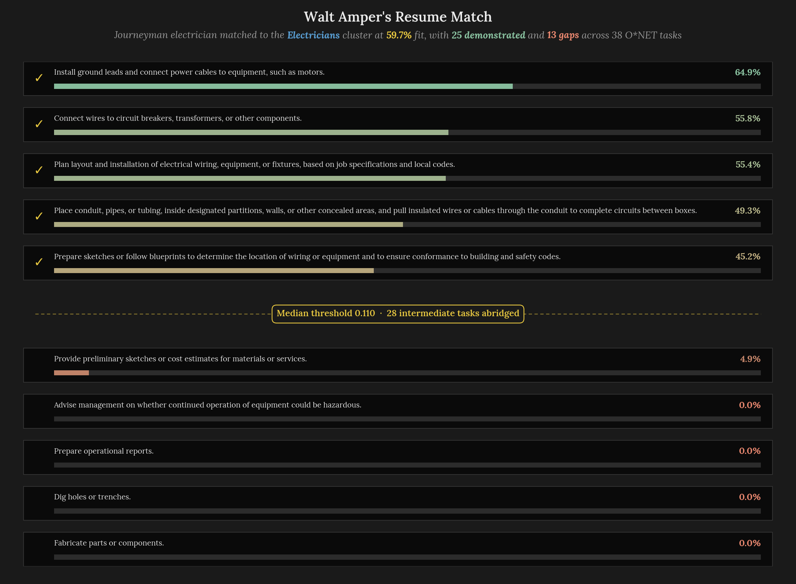  
*Figure 18: Four-panel resume match readout for the Walt Amper journeyman electrician fixture. The header shows the matched cluster (**Electricians**, sector **Building Construction**, Job Zone **3**, fit score **59.7%**, wage expectation **\$71,310**). The lower-left panel shows per-task similarity bars for the **38** O\*NET Task and DWA elements, colored green for **25** demonstrated tasks and red for **13** gaps with the **0.110** global median threshold marked. The lower-right panel ranks the top **10** clusters by SVD-distance fit, showing Electricians as the match with HVAC Mechanics & Installers as a close runner-up. The bottom strip previews the two advancement candidates (*Construction Managers and Civil Engineers*) with their per-task skill bars, both drawn directly from the upward edges in the career graph.*

### Advancement Candidates from the Career Graph

The advancement previews at the bottom of Figure 18 come directly from the career graph's outgoing upward edges for the Electricians cluster. The matcher follows those edges, identifies the two destinations (*Construction Managers at Job Zone 4 with median wage **\$84,940**, and Civil Engineers at Job Zone 4 with median wage **\$91,580***), and runs the same BM25-weighted per-task MaxSim against each destination's SOC Task elements. The output is a second-layer gap analysis per destination, showing which tasks Walt has demonstrated against the advancement destination's requirements and which tasks are new gaps. For both destinations, Walt has few demonstrated tasks (*site-inspection vocabulary and scheduling vocabulary*) and many gaps (*cost-estimation work, design-decision work, regulatory coordination*). The preview surfaces the top **12** tasks per destination in the UI, with the credential stack selected by the Pareto-knee selector appended below in the full Marimo display.

### Why the Matcher Was Rebuilt from TF-IDF to Embeddings

The matcher's TF-IDF-to-embedding-first pivot unfolds across [the original resume-matching implementation](https://github.com/Jybbs/chalkline/pull/24) and the later embedding rewrite. Before the embedding-first matcher was built, the original iteration attempted to match resumes against the pipeline via [TF-IDF](https://en.wikipedia.org/wiki/Tf%E2%80%93idf) over a hand-curated skill vocabulary. The skill vocabulary had grown to **57** skill tokens per posting on average by the time the approach was abandoned, a count the [skill-extraction baseline diagnosis](https://github.com/Jybbs/chalkline/issues/6#issuecomment-4036024346) documents alongside the false-positive removal pass and the supplement-lexicon mining that followed, and the TF-IDF fit time on the **922**-posting corpus the era reported was **6.9 seconds**, compared to the current matcher's sub-second match time. Two problems drove the abandonment. First, the skill-extraction stage required continuous vocabulary maintenance as new posting language entered the corpus, meaning every weekly corpus refresh required human attention to the lexicon. Second, the TF-IDF representation treated every skill token as independent, missing the semantic relationships that matter for construction careers (*"PLC programming" and "motor control" are related concepts that TF-IDF treats as orthogonal unless a human tells it otherwise*).

The sentence-embedding matcher absorbs both problems. Vocabulary maintenance disappears, because the encoder recognizes new posting language automatically. Semantic relationships are preserved in the embedding geometry, meaning PLC programming and motor control produce embeddings whose cosine similarity is high without any human-authored synonym table. The PMI-based gap ranking that was built on top of TF-IDF was [replaced with per-task cosine similarity](https://github.com/Jybbs/chalkline/issues/14#issuecomment-4126314090) alongside the sentence-embedding migration, and BM25 weighting came in later to produce a continuous similarity score per task rather than a binary PMI relevance ranking and to give finer-grained gap resolution.

### Reusing the Fitted SVD Basis

The matcher reuses the SVD basis fitted at pipeline-fit time rather than fitting a new one on each resume. The `ResumeMatcher` assembled by the `matcher` Hamilton node holds a reference to the fitted `TruncatedSVD` object, and at match time the uploaded resume's chunk embeddings are projected through that same transformation. Reusing the basis buys two properties. The first is that the match is consistent with the clustering geometry, wherein a resume is evaluated against the same coordinate system the clusters live in rather than against a bespoke coordinate system derived from the resume alone. The second is that the match is fast, because the SVD projection is a single matrix multiplication on the **n × 768** input, adding effectively no time to the end-to-end match budget. The resume match therefore completes in **< 1 second** on a warm pipeline, dominated by the PDF text extraction and the per-chunk encoding rather than by any matching computation.

The matcher is the last computational stage, and the substrate carrying every stage above has stayed in the background until now.

---

## Engineering Infrastructure

Building a workforce-development artifact that the stakeholder can actually maintain is as much an engineering problem as it is an algorithmic one. A pipeline that runs once on a laptop and produces a correct answer is a proof of concept, whereas a pipeline that refits on a new corpus months later without surfacing a pile of stale-cache or version-skew errors is a working artifact. The substrate around the computational core is what decides which of those two things the final pipeline actually is.

### Hamilton Cache and Content Addressing

The pipeline is structured as **15** Hamilton[^58] nodes declared in [`pipeline/steps.py`](../src/chalkline/pipeline/steps.py), with the end-to-end [orchestrator integration](https://github.com/Jybbs/chalkline/pull/27) threading them into a single `fit()` call. Each node is a plain Python function whose parameter names are also the upstream node names Hamilton resolves them from, meaning the DAG structure is declarative rather than imperative. The `corpus` node takes `config` and returns a `Corpus`, the `raw_vectors` node takes `corpus` and `encoder` and returns an `ndarray` of shape $`(n, 768)`$, and the `reduction` node takes `config` and `raw_vectors` and returns the fitted SVD plus the reduced coordinates. Each node's output is cached to disk under a content-addressed filename whose key is $`\text{hash}(\text{code\_version}(n) \oplus \bigoplus_{i \in \text{inputs}(n)} \text{version}(i))`$, so the cache entry is invalidated exactly when the node's source code changes or when any upstream input's hash changes.

That content-addressing property is what turns the **15**-node DAG into an incremental build system. A fresh clone with no cache takes **~10.4 seconds** to fit, dominated by loading the ONNX encoder session and encoding both the **2,154**-posting corpus and the **60**-SOC Task elements. A warm reload off the cache takes **~0.35 seconds**, because every node's output is read from disk rather than recomputed. The per-node cache entries are keyed by `SHA256` hashes stored in a SQLite `metadata_store.db` that Hamilton maintains alongside the cached data, and the `chalkline cache` CLI command inspects that metadata to show node-to-file mappings when a developer needs to understand which cache entries exist.

Selective invalidation is what makes this property useful during iterative development, and Figure 19 lays out the cache-invalidation pattern across four representative config-field changes.

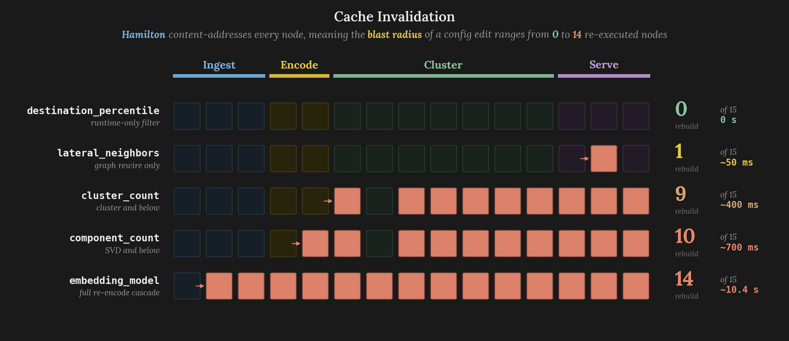  
*Figure 19: Selective cache invalidation for four representative config-field changes. Each panel shows the **15** Hamilton nodes, with **invalidated** nodes in red (*must re-execute*) and **stable** nodes in green (*served from disk cache*). Changing `cluster_count` invalidates **9** of 15 nodes, because the cluster assignment and everything downstream (*centroids, SOC similarity, graph, matcher*) all depend on the cluster count. Changing `component_count` invalidates **10** of 15, because the SVD dimensionality propagates through the entire clustering and matching layers. Changing `lateral_neighbors` invalidates only **1** node (*graph*), because it only affects the graph construction step. Changing `embedding_model` invalidates **14** of 15 nodes, because every downstream step except `corpus` depends on the embedding vectors the encoder produces.*

The practical consequence is that a developer iterating on the credential selector can change the selector's code, re-run `chalkline fit`, and pay only the credential-selector's runtime, because upstream nodes are served from cache. A developer iterating on the SVD dimensionality pays the SVD and clustering costs but not the encoding cost. A developer who updates the encoder pays everything. This incremental-build model is what made the thirty-variant softmax-temperature investigation of [**Section 5**](#clustering-identity-and-wage) tractable, because each variant paid only the cost of re-running the SOC-assignment node and its downstream dependents rather than refitting the pipeline from scratch.

### Pydantic Schemas as Contracts

Node-to-node handoffs are structured by Pydantic models with `extra="forbid"` configuration, meaning any attempt to pass an unexpected field through a node boundary raises a `ValidationError` at the moment of handoff. The schemas are colocated with their domain modules (*[`collection/schemas.py`](../src/chalkline/collection/schemas.py) for `Posting` and `Corpus`, [`pathways/schemas.py`](../src/chalkline/pathways/schemas.py) for `Occupation`, `Credential`, `Reach`, and the selector configs, [`matching/schemas.py`](../src/chalkline/matching/schemas.py) for `MatchResult` and `BM25Config`, [`pipeline/schemas.py`](../src/chalkline/pipeline/schemas.py) for `PipelineConfig` and `CacheRow`*), which keeps each domain's data contracts inspectable without requiring a global type system.

The `extra="forbid"` setting is strict by design, because the alternative of silent acceptance makes schema evolution dangerous, wherein a renamed field silently loses its value across a node boundary and the downstream consumer gets garbage without any error. `extra="forbid"` makes these failures loud, because a schema mismatch shows up as a validation error on the pipeline fit rather than as a silent incorrect result in the output. The `PipelineConfig` schema illustrates the point most concretely, because it governs every hyperparameter the pipeline exposes, and the `extra="forbid"` setting has caught typo-level bugs during development (*`cluster_counts` vs. `cluster_count`*) that would have produced silently wrong results if the schema had been lenient.

### The Test Suite: Production-Relevant Only

The test suite at [`tests/`](../tests/) is scoped to **production-relevant behavior**. It contains **17** test modules across five subpackages covering **collection** (**3**), **display** (**5**), **matching** (**2**), **pathways** (**5**), and **pipeline** (**2**). Three kinds of behavior are explicitly not tested, and each exclusion is a considered choice rather than an oversight. Curation scripts under [`scripts/`](../scripts/) are not tested, because they are fire-and-forget tooling whose output is committed JSON artifacts, and the pipeline consumes the committed output rather than the scripts themselves. Data files under [`data/`](../data/) are not tested, because schema validation belongs in the consuming module (*the lexicon loader validates that [`onet.json`](../data/lexicons/onet.json) conforms to the expected schema at load time*). The Marimo notebook at [`app/main.py`](../app/main.py) is not tested, because it is an interactive interface, rather than a testable module.

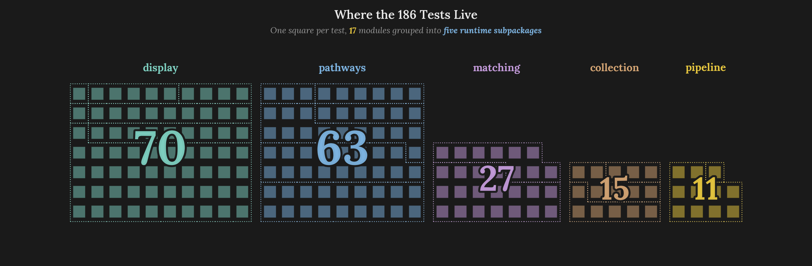  
*Figure 20: Test suite shape. Left panel: test module counts per subpackage, with **pathways** and **display** at **5** modules each, **collection** at **3**, and **matching** and **pipeline** at **2** each. Right panel: fixture inventory showing the JSON lexicon fragments, credential samples, and posting seeds alongside the four test-constant values that parameterize the synthetic fixtures (`CLUSTER_COUNT=4`, `COMPONENT_COUNT=4`, `CORPUS_SIZE=20`, `EMBEDDING_DIM=16`).*

All test fixtures live in `tests/fixtures/` organized by domain subdirectory mirroring the test structure. The synthetic-fixture constants (`CLUSTER_COUNT=4`, `COMPONENT_COUNT=4`, `CORPUS_SIZE=20`, `EMBEDDING_DIM=16`) parameterize a miniature version of the pipeline that runs in **< 1 second** on every test invocation, meaning the test suite does not load the full encoder or operate on the real **2,154**-posting corpus. The test suite exists to verify that node transforms preserve contracts, matrices have the right shapes, distance computations behave correctly, and text normalization produces expected outputs. It does not exist to verify that the pipeline produces good clusters on real data (*that is what the [early exploratory analysis](https://github.com/Jybbs/chalkline/issues/8) verified*) or that the Marimo UI looks right (*that is a manual verification step*).

The tests verify behavior rather than implementation. The [`test_matcher.py`](../tests/matching/test_matcher.py) module asserts that running `Chalkline.match(walt_pdf_bytes)` returns a `MatchResult` whose `matched_cluster.label` is **Electricians** and whose `match_score` exceeds **0.5**. It does not assert on the specific cosine-similarity values, the specific ordering of tasks, or the specific BM25 weights, because those values would shift under any non-functional change to the encoder or the corpus. The test captures the *semantic* guarantee the matcher provides without pinning to an implementation detail that refactors would invalidate.

### The Marimo Dashboard: Four Tabs

The user-facing interface is a [Marimo](https://marimo.io/) reactive notebook at [`app/main.py`](../app/main.py) that runs the fitted pipeline and exposes it as a four-tab web application. The tabs are **Splash** (*resume upload surface, fit-status indicator, once-per-session onboarding copy*), **Map** (*interactive career graph with D3 force-directed layout, route panels per destination, per-task skill previews*), **Data** (*corpus provenance, employer distribution, posting-length distribution, cluster landscape*), and **Methods** (*ML internals, SVD variance, cluster-quality panels, credential-selection diagnostics*). Each tab lives as its own renderer under [`src/chalkline/display/tabs/`](../src/chalkline/display/tabs/), with a local [`content.toml`](../src/chalkline/display/tabs/) driving UI labels and tab-specific schema types in [`display/schemas.py`](../src/chalkline/display/schemas.py) governing the data the renderer consumes.

The current four-tab layout is the result of a [dashboard redesign](https://github.com/Jybbs/chalkline/pull/30) that consolidated an earlier six-tab prototype (*Your Match, Resume Feedback, Career Paths, Job Postings, Next Steps, ML Internals*) into three content tabs (*Map, Data, Methods*), with Splash sitting ahead of the three as the entry surface. The [six-to-three rationale](https://github.com/Jybbs/chalkline/issues/29#issuecomment-4240069406) walks through why the D3 career map's own internal navigation model made standalone destination-specific tabs redundant, wherein clicking any cluster node already surfaces its route panel in-place and the old Career Paths / Next Steps tabs were duplicating what the map itself now renders interactively.

The **Map** tab is the centerpiece, implemented in [`display/tabs/map/`](../src/chalkline/display/tabs/map/) as an [AnyWidget](https://anywidget.dev/) wrapper around a D3 force-directed layout. An earlier prototype built the map in [Altair](https://altair-viz.github.io/) using `alt.selection_point` for click interactions, but the requirements for the final interface (*bidirectional state sync between the map and Python, rich node rendering with hero cards and sector badges, detailed HTML tooltips on hover*) exceeded Altair's declarative model. The production layout encodes median annual wage on the horizontal axis (*from **~\$48,000** on the left to **~\$92,000** on the right*), Job Zone on the vertical axis (*within each sector grouping*), sector on node color, and edge kind on edge color. Clicking a destination cluster drives a reactive route panel that surfaces the credential stack the Pareto-knee selector picked for that destination, the top SOC anchor, and the per-task gap view that [**Section 7**](#resume-matching-and-gap-analysis) describes.

The force-directed layout replaced an earlier column-based layout that placed each Job Zone in its own vertical column, and [two factors drove that change](https://github.com/Jybbs/chalkline/issues/29#issuecomment-4240069406). The first factor is audience intuition, wherein a construction worker scanning career options thinks in terms of earning potential rather than O\*NET Job Zone classifications, so a salary-indexed horizontal axis is immediately legible whereas a Job-Zone column layout requires understanding a five-tier experience taxonomy before the map communicates anything. The second factor is visual density, because **10** of the **20** clusters sit at Job Zone 2, which would produce a dense left column and two sparse columns to its right under fixed-column layout. The force simulation distributes nodes to minimize overlap while respecting the wage gradient, handling the uneven distribution without any manual spacing adjustments.

### Progress Display

Fit-time progress is surfaced through a `ProgressDisplay` protocol defined in [`pipeline/progress.py`](../src/chalkline/pipeline/progress.py) with two concrete implementations that serve two interaction modes. `RichDisplay` is used when the pipeline runs from the `chalkline fit` CLI command and renders a Rich-based progress bar with node-by-node timings and an elapsed-time column, so a developer kicking off a fresh cold start can watch each of the **15** Hamilton nodes tick through in order. `MarimoDisplay` is used when the pipeline runs inside the dashboard and surfaces progress as reactive Marimo cells that re-render as each node completes, which keeps the UI responsive during the **~10.4-second** cold start without blocking the page.

Both implementations conform to the same `ProgressDisplay` protocol, which is injected into the Hamilton driver at fit time via the pipeline's factory entry point in [`pipeline/orchestrator.py`](../src/chalkline/pipeline/orchestrator.py). That abstraction lets a single `Chalkline.fit(config, display)` call work identically whether it is invoked from a terminal, a Marimo notebook, or a test harness, and it keeps progress rendering entirely out of the pipeline's computational path so swapping renderers costs nothing in fit-time throughput.

### CLI: fit, launch, cache

Three Typer commands are registered under the `chalkline` entry point and cover the full development loop. [`chalkline fit`](../src/chalkline/cli/fit.py) runs the pipeline and warms the Hamilton cache, accepting `--lexicon-dir`, `--postings-dir`, and `--verbose` options for overriding the default config fields and toggling debug-level loguru output. [`chalkline launch`](../src/chalkline/cli/launch.py) pre-fits the pipeline against the committed lexicons and then delegates to `marimo run app/main.py`, producing the dashboard at the default local URL so a stakeholder can navigate to a single address rather than learning a notebook runner. [`chalkline cache`](../src/chalkline/cli/cache.py) reads the Hamilton SQLite metadata store at `.cache/hamilton/metadata_store.db` and prints the node-to-file mapping so a developer investigating a stale result can see exactly which cache entry corresponds to which pipeline node and when it was last written.

The CLI stays minimal, because the primary interface is the Marimo dashboard rather than the terminal, but the three commands are what a new contributor needs in the order they typically need them: *fit once, launch to explore, inspect the cache when something surprises you*.

---

## Stakeholder Data: Gaps and Adjustments

The AGC Maine stakeholder workbook defined the initial scope of the project and delivered the starter lexicon the pipeline consumed. It was a thoughtful artifact, compiled by an experienced program coordinator, and it carried more domain knowledge per page than any academic taxonomy Chalkline could have sourced elsewhere. As the pipeline matured, a handful of questions surfaced that the workbook had not needed to answer in its original context, and this section walks through where the pipeline routed around those open questions and what a future workbook iteration would benefit from addressing explicitly.

### Davis-Bacon Trades as a Future Second-Axis Taxonomy

Maine public-works construction operates under federal [Davis-Bacon Act](https://en.wikipedia.org/wiki/Davis%E2%80%93Bacon_Act_of_1931) prevailing-wage requirements, which enumerate a detailed trade taxonomy for federally-funded projects. The Davis-Bacon trade list would pair with the O\*NET SOC list the pipeline currently uses, because Davis-Bacon distinguishes between trade variants (*carpenter vs. carpet layer vs. hardwood floor layer*) at a finer granularity than O\*NET does, and Davis-Bacon wage determinations provide a prevailing-wage signal that the BLS OEWS medians do not capture. The stakeholder workbook does not include a Davis-Bacon lexicon, which is consistent with AGC's member firms working across both prevailing-wage and non-prevailing-wage projects and the association not indexing its program design on Davis-Bacon specifically. A future pipeline iteration could incorporate Davis-Bacon trade codes as a second-axis taxonomy alongside O\*NET, which would let the clustering stage identify prevailing-wage-specific trade variants that the current SOC-anchored taxonomy merges into larger clusters.

### Sector Assignment Had to Be Derived Rather Than Imposed

The stakeholder workbook's three-sector taxonomy (**Building Construction**, **Heavy Highway Construction**, **Construction Managers**) proved more useful as a display-level grouping than as an input to the clustering algorithm. During the [early clustering investigation](https://github.com/Jybbs/chalkline/issues/8), the clustering stage consistently produced partitions whose principal geometric distinction was *trade* rather than *sector*, and the stakeholder-defined sectors cut across trade boundaries in ways the TF-IDF representation geometry did not reproduce. The pipeline routed around this by computing sector membership as a downstream inheritance rather than as a clustering constraint, wherein each cluster's sector emerges from the softmax-weighted distribution over its top-3 SOCs (*detailed in the [sector-assignment fix](https://github.com/Jybbs/chalkline/pull/40)*) rather than from a stakeholder-assigned label. This choice preserves all three sectors in the display layer without forcing the clustering to honor boundaries the data does not support, and the fitted pipeline surfaces **9** clusters in Building Construction, **6** in Heavy Highway Construction, and **5** in Construction Managers.

### Temporal Metadata as a Future Layer

The stakeholder workbook is a static inventory of occupations, apprenticeships, programs, and employers, which is the right shape for its original purpose as a scope document. Extending it with a temporal dimension would let the pipeline answer questions about which of these occupations are hiring right now or how apprenticeship enrollment has shifted over the last three years. The pipeline's current temporal information comes from the JobSpy-collected posting dates, which cover the **2018-08** to **2026-04** window with heavy concentration in the most recent twelve months. A future workbook iteration that carried apprenticeship start-date distributions, program completion rates over time, and employer hiring cycles would give the pipeline a second temporal axis against which the posting-date distribution could be validated, and it would let the Marimo dashboard surface hiring seasonality as a feature of each cluster.

### Requirements-Section Extraction as an Open Task

Job postings typically contain a requirements section that enumerates *must-have* credentials, licenses, and experience levels separately from the *preferred* credentials the employer would like to see. Extracting this structured requirement from free-text postings is an open information-extraction problem that sits outside the workbook's remit as a scope document. An [earlier attempt during the PMI co-occurrence work](https://github.com/Jybbs/chalkline/issues/9) evaluated four scoping strategies (*requirements only, requirements plus responsibilities, full-text baseline, and preamble-and-tail dropping*) and found that requirements-only scoping dropped **115** postings to zero skills while losing **149** vocabulary items, so the full-text baseline remained as the input the extraction stage consumed. That investigation ran under the TF-IDF era and does not carry directly over to the embedding-based pipeline, which currently treats the full posting description as a single encoding target, meaning the cluster embeddings capture the requirements section's language alongside the day-to-day duties, the company-culture fluff, and the compensation language. A future iteration that separated requirements from other posting content would let the credential-selection stage operate on a narrower target (*what the employer actually requires*) rather than on the full posting description, and it would let the gap-analysis stage distinguish between a missing required credential and a missing nice-to-have one in the UI.

### The Override Mechanism in Practice

The stakeholder override mechanism at [`onet_codes.json`](../data/stakeholder/additions/onet_codes.json) is the pipeline's release valve for places where the reference workbook's organizational cut of the sectors diverges from what the clustering and advancement-edge math needs. The override file currently holds **42** entries that distribute across **23** Building Construction, **8** Heavy Highway Construction, and **11** Construction Managers SOCs, with **five** of them (*Construction Managers, Civil Engineers, Transportation Engineers, Architectural and Civil Drafters, and Construction Inspectors*) specifically re-placing SOCs whose workbook-assigned sector did not match what the pipeline's advancement edges needed. The mechanism has the virtue of being reversible (*the reference workbook is untouched, so a future stakeholder can reconsider the overrides without having to edit their own authoritative file*) and traceable (*each override entry carries a comment field that documents the rationale*). This pattern generalizes to other stakeholder-data gaps. A future residential-scope expansion could land as a `data/stakeholder/additions/residential_socs.json` file without modifying the original reference workbook. A Davis-Bacon lexicon could land as `data/stakeholder/additions/davis_bacon_trades.json` alongside the O\*NET SOCs. The pattern preserves the stakeholder's authorship while letting the pipeline evolve past the original workbook's constraints.

### What the Next Refresh Should Carry

The subsections above each describe one open workbook question. Collapsed into a checklist that AGC Maine could act on at the next refresh, they become four additions:

- **A Davis-Bacon trade-code extension** for prevailing-wage construction work, giving the clustering stage a second-axis taxonomy alongside O\*NET
- **A temporal layer on apprenticeship and program data** so hiring-cycle and enrollment-cycle seasonality can be validated against the posting corpus
- **A starter schema for requirements-section extraction** that a future information-extraction stage can consume to separate must-have credentials from preferred ones
- **A sector-boundary note** that clarifies how Construction Managers sector clusters should be treated in the display layer when their underlying trades span Building Construction and Heavy Highway Construction

Any of these can land through the `additions/` override mechanism without disturbing the original reference workbook, and the same route is open to a residential-scope expansion if AGC's programmatic focus ever broadens past its current commercial-and-public-works remit. These gaps are stakeholder-facing. The [**limitations section**](#limitations) turns next to the algorithmic gaps, and the two sets together bound what the prototype can honestly claim to model.

---

## Limitations

The prototype has clear limitations that should be stated explicitly, rather than buried in a paragraph of hedging, and six of them matter most.

### Corpus Recency Skew

The **2,154**-posting corpus is heavily concentrated in **2025-2026** (**2,033** of **2,154** postings, or **94.4%**), a concentration that reflects Indeed's retention policy, rather than a sampling choice. A corpus covering a longer horizon with even sampling across years would give the clustering stage a more robust signal against seasonal hiring cycles and business-cycle shifts.

### Low Silhouette at the Per-Posting Level

The global silhouette of **0.138** reflects the hub-and-spoke topology the data itself produced under every clustering variant tried. That said, the silhouette remains a low absolute number, and readers accustomed to the silhouette conventions of Iris-style clusters should understand that the score here is being evaluated against a non-spherical manifold. A future evaluation pass could supplement silhouette with the cluster-purity metrics that Fred and Jain's evidence-accumulation framework[^32] exposes, which would give a cluster-level reading less sensitive to the hub effect.

### Wage Median versus Individual Prediction Framing

The cluster wage expectations are derived from BLS OEWS medians and are appropriate as *population-level* wage signals for program-design purposes. Those same expectations should not be read as *individual-level* wage predictions for a specific user uploading a specific resume, because individual wages depend on location, seniority, employer size, union membership, and benefits-package details that the pipeline does not observe. The Marimo UI labels the wage figure as "*wage expectation*" rather than "*predicted salary*" for this reason, and the distinction carries directly over into how the number should be cited outside the tool as well.

### Credential Catalog Skewed to Certifications

The **836**-entry catalog contains **787** certifications (**94.1%**), **19** apprenticeships (**2.3%**), and **30** programs (**3.6%**). The certification skew reflects the breadth of the CareerOneStop source, and it means the Pareto-knee selector chooses among certification subsets in most cases, with apprenticeships and programs surfacing only when the destination cluster is a clear entry-level-to-journeyman transition. A more balanced credential catalog would produce more diverse recommended stacks.

### Graph Edges Limited to Two Lateral and Two Upward

The `lateral_neighbors = 2` and `upward_neighbors = 2` configuration produces **96** edges, which is an intentionally sparse graph optimized for display legibility. Loosening either neighbor count would surface more pathway options but would make the map visually busy and would risk surfacing nearest-neighbor relationships whose strength does not warrant a recommendation. Future work could expose the neighbor counts to end-user control, letting a user ask for all paths within a configurable cosine-distance threshold instead of the fixed two-nearest default.

### Only Three Populated Job Zones

The fitted clustering places all **20** clusters at Zones 2 through 4, with Zone 1 and Zone 5 SOCs sitting in the lexicon but never surfacing as the MaxSim-nearest SOC for any cluster. Both absences share the same cause, because bottom-up agglomerative clustering on cone-shaped sentence-transformer embeddings finds dense concentrations in the interior of the manifold and blurs the top-and-bottom edges of the taxonomy into their nearest neighbors. Surfacing Zone 1 or Zone 5 clusters reliably would need a complementary approach (*divisive clustering, explicit role-breadth features, or a top-down taxonomic anchor*) layered on top of the current bottom-up stack.

---

## Future Work

Six concrete directions would materially extend the prototype from its current state.

### Corpus Refresh with Expanded Search Terms

The current JobSpy query list emphasizes the stakeholder workbook's prominent occupations and under-samples plumbers, welders, ironworkers, HVAC installers, masons, and foremen. A refresh run with an expanded search-term list would produce a more balanced corpus and let the clustering surface trades that are currently absorbed into adjacent clusters. A secondary benefit is that the expanded search terms would stress-test the pipeline's ability to absorb new vocabulary without re-tuning the encoder or re-fitting the SVD.

### Inverse-Cluster-Frequency Credential Reweighting

Credentials that apply to many clusters (*OSHA 10, First Aid, general safety cards*) currently contribute to the Pareto-knee selector on equal footing with credentials that apply to few clusters (*specific HVAC refrigerant handling cards, welder qualifications for specific alloys*). An inverse-cluster-frequency reweighting on the candidate similarities would let the narrow-specificity credentials claim more weight when they apply, producing recommended stacks that are more sharply tuned to the destination.

### Temporal Dimension as Corpora Grow

As the corpus accumulates across annual refreshes, a temporal dimension on the clustering output would let the stakeholder track how cluster sizes shift over time, which trades are growing or shrinking in hiring volume, and which sectors are absorbing new postings. The infrastructure for this is already in place through the `date_collected` field on `Posting`, and the gap is that the current pipeline does not expose temporal slicing in the display layer.

### Stakeholder-Facing Update Cadence

The pipeline is re-runnable on a fresh corpus in **~10.4 seconds**, which puts the cost of an annual refresh below any reasonable stakeholder pain threshold. The harder question is what cadence matches the stakeholder's update appetite, because a monthly refresh may be too fast for AGC Maine's program-design cycle whereas an annual refresh may lag behind the hiring cycles the stakeholder cares about. Future work should establish a cadence that matches the stakeholder's programmatic rhythm alongside a changelog format that surfaces cluster drift, wage drift, and credential-stack drift between refreshes.

### Domain-Adapted Sentence Encoder

The general-purpose `gte-base-en-v1.5` backbone was chosen to avoid the maintenance cost of a domain-specific encoder, but a continued-pretraining pass on the **2,154**-posting corpus plus the **60**-SOC O\*NET elements plus the **836**-entry credential catalog could produce a domain-adapted encoder whose embedding geometry is sharper on construction-specific vocabulary. CareerBERT[^16] and JobBERT[^63] are the methodological references for this work.

### Instrumented Per-Node Timing

[**Figure 6**](#representation-encoding-and-reduction) decomposes the cold-start budget using architecture-derived estimates anchored on the encoder's measured batched throughput rather than recorded per-node measurements. Hamilton's lifecycle adapter API exposes `run_before_node_execution` and `run_after_node_execution` hooks that can capture steady-state per-node durations once the first-call ONNX graph-compilation overhead is amortized by a warm-up batch, which would let Figure 6 surface a measured decomposition in place of the current estimates. The engineering substrate is ready to support this measurement, and the only missing piece is a fit-time benchmarking script that disables ONNX cold-start effects and records timings to `data/node_timings.json` for Figure 6 to consume directly.

---

## Conclusion

Chalkline lands as a **20**-cluster, **96**-edge map of Maine's construction industry, fit in roughly ten seconds and served from cache in a third of a second. The finding the report most wants to transmit, though, is one the original specification did not anticipate. The construction labor market has a hub-and-spoke topology the clustering could not dissolve, and every attempt to dissolve it produced evidence that the topology belongs to the data rather than to the method. The [early clustering investigation](https://github.com/Jybbs/chalkline/issues/8#issuecomment-4051970165) treated the hub as a signal-processing failure at first, reaching for more clustering algorithms, more representations, and more distance metrics until one of them would split the hub into the trade-pure clusters an outside observer might expect. None of those attempts worked, because construction careers include generalist roles (*foremen, superintendents, project coordinators*) whose skill breadth places them geometrically in the interior of the manifold by the nature of the work they describe.

Read across the whole pipeline, that persistence is the unifying lesson the body sections have been circling. Career paths are paths *because* skills overlap, the embedding geometry inherits that overlap as anisotropy, the clustering inherits it as a non-spherical manifold and a low global silhouette, and the agglomerative tree inherits it as a ceiling where the broadest roles never concentrate into clusters of their own. The pipeline stopped fighting the hub and instead let it cohere into a **General Maintenance Workers** cluster whose identity is defensible on both stakeholder and algorithmic grounds. An unsupervised pipeline should be willing to let the data surprise the specification, because the specification is a starting hypothesis and the data is the evidence that validates or refutes it.

Algorithmic and expert-panel maps read better as complements than as competitors. The bottom-up algorithmic map refreshes cheaply, surfaces labor-market shifts as they happen, carries per-edge provenance, and scales to any geography with a posting corpus and an O\*NET lexicon. The top-down expert-panel map carries nuance and narrative coherence the algorithmic approach cannot easily reproduce. A mature workforce-development practice likely wants both, because the algorithmic map surfaces the current state of the labor market while the expert interpretation explains what that state means for programmatic investment. Chalkline is a working prototype of the algorithmic half of that pairing, grounded by AGC Maine's partnership in a stakeholder with real training programs to target.

The distance between the current prototype and a production deployment is engineering work, not algorithmic work. A stakeholder-facing release would need a managed corpus-refresh pipeline, an admin interface for adjusting the curated lexicon, authentication for resume upload, a privacy-conscious PII-handling layer for uploaded PDFs, and a way for AGC Maine to publish a versioned map alongside a narrative interpretation. The substrate [**Section 8**](#engineering-infrastructure) describes is designed to accommodate those pieces, which is why the algorithmic core had to be right before the engineering layer could go on top. The defense assembled across earlier sections with argument, figures, and evidence is what leaves the prototype reviewable rather than only buildable.

---

## Bibliography

[^1]: del Rio-Chanona, et al. 2021. "Occupational Mobility and Automation: A Data-Driven Network Model." *Journal of the Royal Society Interface* 18 (174): 20200898. https://doi.org/10.1098/rsif.2020.0898

[^2]: Dixon, et al. 2023. "Occupational Models from 42 Million Unstructured Job Postings." *Patterns* 4 (7): 100757. https://doi.org/10.1016/j.patter.2023.100757

[^3]: Ramshaw & Marcus. 1995. "Text Chunking Using Transformation-Based Learning." *Proceedings of the Third Workshop on Very Large Corpora*: 82-94. https://aclanthology.org/W95-0107/

[^4]: Sparck Jones. 1972. "A Statistical Interpretation of Term Specificity and Its Application in Retrieval." *Journal of Documentation* 28(1): 11-21. https://doi.org/10.1108/eb026526

[^5]: Porter. 1980. "An Algorithm for Suffix Stripping." *Program* 14(3): 130-137. https://doi.org/10.1108/eb046814

[^6]: Senger, et al. 2024. "Deep Learning-based Computational Job Market Analysis: A Survey on Skill Extraction and Classification from Job Postings." *Proceedings of the First Workshop on Natural Language Processing for Human Resources (NLP4HR 2024)*. https://doi.org/10.18653/v1/2024.nlp4hr-1.1

[^7]: Aho & Corasick. 1975. "Efficient String Matching: An Aid to Bibliographic Search." *Communications of the ACM* 18(6): 333-340. https://doi.org/10.1145/360825.360855

[^8]: Lukauskas, et al. 2023. "Enhancing Skills Demand Understanding through Job Ad Segmentation Using NLP and Clustering Techniques." *Applied Sciences* 13(10): 6119. https://doi.org/10.3390/app13106119

[^9]: Zhang, et al. 2022. "Skill Extraction from Job Postings Using Weak Supervision." *RecSys in HR '22: The 2nd Workshop on Recommender Systems for Human Resources, 16th ACM Conference on Recommender Systems. CEUR Workshop Proceedings, Vol. 3218*. https://arxiv.org/abs/2209.08071

[^10]: Robertson. 2004. "Understanding Inverse Document Frequency: On Theoretical Arguments for IDF." *Journal of Documentation* 60(5): 503-520. https://doi.org/10.1108/00220410410560582

[^11]: Grishman, R. and Kittredge, R. 1986. *Analyzing Language in Restricted Domains: Sublanguage Description and Processing*. Lawrence Erlbaum Associates. https://doi.org/10.4324/9781315802206

[^12]: Schofield, A. and Mimno, D. 2016. "Comparing Apples to Apple: The Effects of Stemmers on Topic Models." *Transactions of the Association for Computational Linguistics* 4:287-300. https://doi.org/10.1162/tacl_a_00099

[^13]: Kettunen, K. 2009. "Reductive and generative approaches to management of morphological variation of keywords in monolingual information retrieval: An overview." *Journal of Documentation* 65(2):267-290. https://doi.org/10.1108/00220410910937615

[^14]: Kettunen, Airio & Järvelin. 2007. "Restricted inflectional form generation in management of morphological keyword variation." *Information Retrieval* 10(4-5): 415-444. https://doi.org/10.1007/s10791-007-9030-z

[^15]: Manning, C., Raghavan, P., and Schütze, H. 2008. "Stemming and lemmatization." *Introduction to Information Retrieval*, Ch. 2. Cambridge University Press. https://nlp.stanford.edu/IR-book/

[^16]: Rosenberger, et al. 2025. "CareerBERT: Matching Resumes to ESCO Jobs in a Shared Embedding Space for Generic Job Recommendations." *Expert Systems with Applications* 275: 127043. https://doi.org/10.1016/j.eswa.2025.127043

[^17]: Halko, Martinsson & Tropp. 2011. "Finding Structure with Randomness: Probabilistic Algorithms for Constructing Approximate Matrix Decompositions." *SIAM Review* 53(2): 217-288. https://doi.org/10.1137/090771806

[^18]: Deerwester, Dumais, Furnas, Landauer & Harshman. 1990. "Indexing by Latent Semantic Analysis." *Journal of the American Society for Information Science* 41(6): 391-407. https://doi.org/10.1002/(SICI)1097-4571(199009)41:6<391::AID-ASI1>3.0.CO;2-9

[^19]: Cattell. 1966. "The Scree Test for the Number of Factors." *Multivariate Behavioral Research* 1(2): 245-276. https://doi.org/10.1207/s15327906mbr0102_10

[^20]: Davies & Bouldin. 1979. "A Cluster Separation Measure." *IEEE Transactions on Pattern Analysis and Machine Intelligence* PAMI-1 (2): 224-227. https://doi.org/10.1109/TPAMI.1979.4766909

[^21]: Caliński & Harabasz. 1974. "A Dendrite Method for Cluster Analysis." *Communications in Statistics* 3 (1): 1-27. https://doi.org/10.1080/03610927408827101

[^22]: Ester, Kriegel, Sander & Xu. 1996. "A Density-Based Algorithm for Discovering Clusters in Large Spatial Databases with Noise." *KDD-96*: 226-231. https://dl.acm.org/doi/10.5555/3001460.3001507

[^23]: Hamilton, Virginia. 2012. "Career Pathway and Cluster Skill Development: Promising Models from the United States." *OECD Local Economic and Employment Development (LEED) Papers* 2012/14. https://doi.org/10.1787/5k94g1s6f7td-en

[^24]: Hubert & Arabie. 1985. "Comparing Partitions." *Journal of Classification* 2(1): 193-218. https://doi.org/10.1007/BF01908075

[^25]: Campello, Moulavi & Sander. 2013. "Density-Based Clustering Based on Hierarchical Density Estimates." *PAKDD*: 160-172. https://doi.org/10.1007/978-3-642-37456-2_14

[^26]: Satopaa, Albrecht, Irwin & Raghavan. 2011. "Finding a 'Kneedle' in a Haystack: Detecting Knee Points in System Behavior." *ICDCS Workshops*: 166-171. https://doi.org/10.1109/ICDCSW.2011.20

[^27]: Ward, Joe H., Jr. 1963. "Hierarchical Grouping to Optimize an Objective Function." *Journal of the American Statistical Association* 58(301): 236-244. https://doi.org/10.1080/01621459.1963.10500845

[^28]: Comaniciu & Meer. 2002. "Mean Shift: A Robust Approach Toward Feature Space Analysis." *IEEE Transactions on Pattern Analysis and Machine Intelligence* 24(5): 603-619. https://doi.org/10.1109/34.1000236

[^29]: Rousseeuw. 1987. "Silhouettes: A Graphical Aid to the Interpretation and Validation of Cluster Analysis." *Journal of Computational and Applied Mathematics* 20: 53-65. https://doi.org/10.1016/0377-0427(87)90125-7

[^30]: Sokal & Rohlf. 1962. "The Comparison of Dendrograms by Objective Methods." *Taxon* 11(2): 33-40. https://doi.org/10.2307/1217208

[^31]: Djumalieva, Jyldyz, and Cath Sleeman. 2018. "An Open and Data-driven Taxonomy of Skills Extracted from Online Job Adverts." *ESCoE Discussion Paper 2018-13*. https://www.escoe.ac.uk/publications/an-open-and-data-driven-taxonomy-of-skills-extracted-from-online-job-adverts/

[^32]: Fred, Ana L. N., and Anil K. Jain. 2005. "Combining Multiple Clusterings Using Evidence Accumulation." *IEEE Transactions on Pattern Analysis and Machine Intelligence* 27 (6): 835–850. https://doi.org/10.1109/TPAMI.2005.113

[^33]: Lazear, Edward P. 2005. "Entrepreneurship." *Journal of Labor Economics* 23 (4): 649–680. https://doi.org/10.1086/491605

[^34]: Aggarwal, Charu C., Alexander Hinneburg, and Daniel A. Keim. 2001. "On the Surprising Behavior of Distance Metrics in High Dimensional Space." *Database Theory — ICDT 2001* (Lecture Notes in Computer Science, vol. 1973): 420–434. https://doi.org/10.1007/3-540-44503-X_27

[^35]: Qannari, El Mostafa, Philippe Courcoux, and Pauline Faye. 2014. "Significance Test of the Adjusted Rand Index. Application to the Free Sorting Task." *Food Quality and Preference* 32: 93–97. https://doi.org/10.1016/j.foodqual.2013.05.005

[^36]: Alabdulkareem, Ahmad, Morgan R. Frank, Lijun Sun, Bedoor AlShebli, César Hidalgo, and Iyad Rahwan. 2018. "Unpacking the Polarization of Workplace Skills." *Science Advances* 4 (7): eaao6030. https://doi.org/10.1126/sciadv.aao6030

[^37]: Dunning, Ted. 1993. "Accurate Methods for the Statistics of Surprise and Coincidence." *Computational Linguistics* 19(1): 61-74. https://aclanthology.org/J93-1003/

[^38]: Agrawal & Srikant. 1994. "Fast Algorithms for Mining Association Rules in Large Databases." *Proceedings of the 20th International Conference on Very Large Data Bases (VLDB '94)*: 487–499. https://dl.acm.org/doi/10.5555/645920.672836

[^39]: Blondel, Guillaume, Lambiotte & Lefebvre. 2008. "Fast Unfolding of Communities in Large Networks." *Journal of Statistical Mechanics: Theory and Experiment* P10008. https://doi.org/10.1088/1742-5468/2008/10/P10008

[^40]: Newman & Girvan. 2004. "Finding and Evaluating Community Structure in Networks." *Physical Review E* 69(2): 026113. https://doi.org/10.1103/PhysRevE.69.026113

[^41]: Bouma, Gerlof. 2009. "Normalized (Pointwise) Mutual Information in Collocation Extraction." *Proceedings of the Biennial GSCL Conference 2009*: 31–40. https://svn.spraakdata.gu.se/repos/gerlof/pub/www/Docs/npmi-pfd.pdf

[^42]: Church & Hanks. 1990. "Word Association Norms, Mutual Information, and Lexicography." *Computational Linguistics* 16(1): 22-29. https://aclanthology.org/J90-1003/

[^43]: Levy, Shalom & Chalamish. 2025. "A Guide to Similarity Measures and Their Data Science Applications." *Journal of Big Data* 12: 188. https://doi.org/10.1186/s40537-025-01227-1

[^44]: de Groot, et al. 2021. "Job Posting-Enriched Knowledge Graph for Skills-based Matching." *RecSys in HR '21 Workshop, CEUR Workshop Proceedings, Vol. 2967*. https://arxiv.org/abs/2109.02554

[^45]: Khelkhal & Lanasri. 2025. "Smart-Hiring: An Explainable End-to-End Pipeline for CV Information Extraction and Job Matching." https://doi.org/10.48550/arXiv.2511.02537

[^46]: Lee, et al. 2025. "CAPER: Enhancing Career Trajectory Prediction using Temporal Knowledge Graph and Ternary Relationship." *Proceedings of the 31st ACM SIGKDD Conference (KDD '25)*: 647–658. https://doi.org/10.1145/3690624.3709329

[^47]: Avlonitis, et al. 2023. "Career Path Recommendations for Long-term Income Maximization: A Reinforcement Learning Approach." https://ceur-ws.org/Vol-3490/RecSysHR2023-paper_2.pdf

[^48]: Senger, et al. 2025. "Toward More Realistic Career Path Prediction: Evaluation and Methods." *Frontiers in Big Data* 8. https://doi.org/10.3389/fdata.2025.1564521

[^49]: Freeman. 1977. "A Set of Measures of Centrality Based on Betweenness." *Sociometry* 40(1): 35-41. https://doi.org/10.2307/3033543

[^50]: Pollack. 1960. "Letter to the Editor—The Maximum Capacity Through a Network." *Operations Research* 8 (5): 733–736. https://doi.org/10.1287/opre.8.5.733

[^51]: Page, Brin, Motwani & Winograd. 1999. "The PageRank Citation Ranking: Bringing Order to the Web." Stanford InfoLab Technical Report 1999-66. http://ilpubs.stanford.edu:8090/422/1/1999-66.pdf

[^52]: Frej, et al. 2024. "Course Recommender Systems Need to Consider the Job Market." *Proceedings of the 47th ACM SIGIR Conference*: 522-532. https://doi.org/10.1145/3626772.3657847

[^53]: Zhang, Gaifan, Yi Zhou, and Danushka Bollegala. 2024. "Evaluating Unsupervised Dimensionality Reduction Methods for Pretrained Sentence Embeddings." *Proceedings of LREC-COLING 2024*: 6530-6543. https://aclanthology.org/2024.lrec-main.579/

[^54]: Fettach, Yousra, Adil Bahaj, and Mounir Ghogho. 2024. "JobEdKG: An Uncertain Knowledge Graph-Based Approach for Recommending Online Courses and Predicting In-Demand Skills Based on Career Choices." *Engineering Applications of Artificial Intelligence* 131: 107779. https://doi.org/10.1016/j.engappai.2023.107779

[^55]: Boškoski, Pavle, Tjaša Redek, Matija Perne, and Biljana Mileva Boshkoska. 2024. "Career Path Discovery through Bipartite Graphs." *Journal of Decision Systems* 33(sup1): 140-153. https://doi.org/10.1080/12460125.2024.2354585

[^56]: Alonso, Ruben, Danilo Dessí, Antonello Meloni, and Diego Reforgiato Recupero. 2025. "A Novel Approach for Job Matching and Skill Recommendation Using Transformers and the O\*NET Database." *Big Data Research* 39: 100509. https://doi.org/10.1016/j.bdr.2025.100509

[^57]: Ortakci, Yasin. 2024. "Revolutionary Text Clustering: Investigating Transfer Learning Capacity of SBERT Models through Pooling Techniques." *Engineering Science and Technology, an International Journal* 55: 101730. https://doi.org/10.1016/j.jestch.2024.101730

[^58]: Krawczyk, et al. 2022. "Hamilton: Enabling Software Engineering Best Practices for Data Transformations via Generalized Dataflow Graphs." *1st International Workshop on Data Ecosystems (DEco@VLDB 2022), CEUR Workshop Proceedings, Vol. 3306*: 41-50. https://ceur-ws.org/Vol-3306/paper5.pdf

[^59]: Robertson, Stephen, and Hugo Zaragoza. 2009. "The Probabilistic Relevance Framework: BM25 and Beyond." *Foundations and Trends in Information Retrieval* 3(4): 333-389. https://doi.org/10.1561/1500000019

[^60]: Khattab, Omar, and Matei Zaharia. 2020. "ColBERT: Efficient and Effective Passage Search via Contextualized Late Interaction over BERT." *Proceedings of the 43rd International ACM SIGIR Conference on Research and Development in Information Retrieval*: 39-48. https://doi.org/10.1145/3397271.3401075

[^61]: Santhanam, Keshav, Omar Khattab, Jon Saad-Falcon, Christopher Potts, and Matei Zaharia. 2022. "ColBERTv2: Effective and Efficient Retrieval via Lightweight Late Interaction." *Proceedings of the 2022 Conference of the North American Chapter of the Association for Computational Linguistics: Human Language Technologies*: 3715-3734. https://doi.org/10.18653/v1/2022.naacl-main.272

[^62]: Humeau, Samuel, Kurt Shuster, Marie-Anne Lachaux, and Jason Weston. 2020. "Poly-encoders: Architectures and Pre-training Strategies for Fast and Accurate Multi-sentence Scoring." *Proceedings of the 8th International Conference on Learning Representations (ICLR 2020)*. https://doi.org/10.48550/arXiv.1905.01969

[^63]: Decorte, Jens-Joris, Jeroen Van Hautte, Thomas Demeester, and Chris Develder. 2021. "JobBERT: Understanding Job Titles through Skills." *FEAST Workshop at ECML-PKDD 2021*. https://doi.org/10.48550/arXiv.2109.09605

[^64]: Turrell, Arthur, Bradley Speigner, Jyldyz Djumalieva, David Copple, and James Thurgood. 2019. "Transforming Naturally Occurring Text Data into Economic Statistics: The Case of Online Job Vacancy Postings." *NBER Working Paper 25837*. https://doi.org/10.3386/w25837

[^65]: Achananuparp, Palakorn, Ee-Peng Lim, and Yao Lu. 2025. "A Multi-Stage Framework with Taxonomy-Guided Reasoning for Occupation Classification Using Large Language Models." arXiv preprint, accepted at ICWSM 2026. https://doi.org/10.48550/arXiv.2503.12989

[^66]: Ethayarajh, Kawin. 2019. "How Contextual are Contextualized Word Representations? Comparing the Geometry of BERT, ELMo, and GPT-2 Embeddings." *Proceedings of the 2019 Conference on Empirical Methods in Natural Language Processing and the 9th International Joint Conference on Natural Language Processing (EMNLP-IJCNLP)*: 55-65. https://doi.org/10.18653/v1/D19-1006

[^67]: Li, Bohan, Hao Zhou, Junxian He, Mingxuan Wang, Yiming Yang, and Lei Li. 2020. "On the Sentence Embeddings from Pre-trained Language Models." *Proceedings of the 2020 Conference on Empirical Methods in Natural Language Processing (EMNLP)*: 9119-9130. https://doi.org/10.18653/v1/2020.emnlp-main.733
